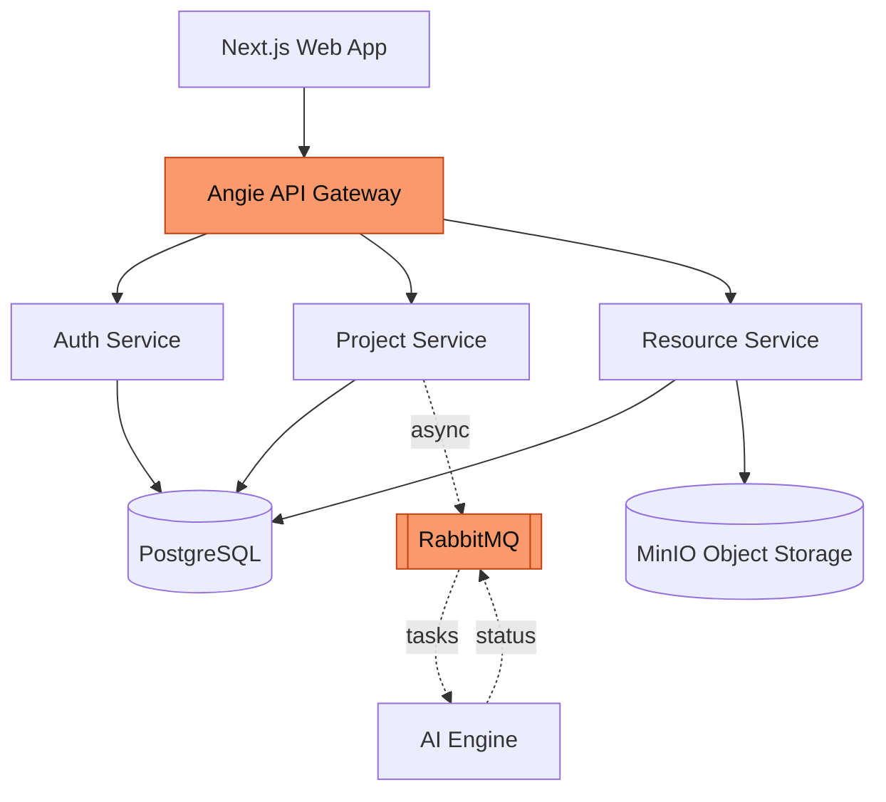

---
# Deck-wide configuration. See https://sli.dev/custom/#headmatter
theme: seriph
title: "Web-based AI-powered SDLC Automation Platform"
titleTemplate: "%s — CairoMotive"
info: |
  ## A Platform for AI-Assisted Software Engineering
  Orchestrating autonomous AI agents across the V-Cycle (SWE.1 / SWE.4 / SWE.6)
  with cybersecurity (TARA, SECO) and functional safety (HARA, FMEA, FTA) analysis.

  Built with [Slidev](https://sli.dev).
author: CairoMotive
keywords: v-cycle,aspice,iso26262,iso21434,ai-agents,cairo-motive
# Apply unocss classes to the current slide
class: text-center
# https://sli.dev/features/drawing
drawings:
  persist: false
# slide transition: https://sli.dev/guide/animations#slide-transitions
transition: slide-left
# enable MDC Syntax: https://sli.dev/features/mdc
mdc: true
# Show line numbers in code blocks
lineNumbers: false
# Match the product brand: dark (quantum-black) by default
colorSchema: dark
# The product uses a geometric grotesque (New Science); Space Grotesk is the closest
# freely-available analog. Headings forced to sans in style.css.
fonts:
  sans: Space Grotesk
  serif: Space Grotesk
  mono: Fira Code
# Aspect ratio of the slides
aspectRatio: 16/9
# Enable presenter mode notes
download: true
exportFilename: defense
hideInToc: false
---

# Web-based AI-powered SDLC Automation Platform

A Platform for AI-Assisted Software Engineering across the V-Cycle

<div class="pt-10 flex justify-center">
  
</div>

<div class="abs-bl m-6 text-sm opacity-70 text-left">
  <div>Supervised by Prof. Dr. Hazem Abbas &amp; Eng. Mahmoud Soliman</div>
  <div>CairoMotive · {{ new Date().getFullYear() }}</div>
</div>

<!--
Presenter notes:
- Welcome the audience.
- One line: the platform brings AI agents to the automotive V-Cycle, with flexible
  deployment — from managed cloud to fully self-hosted — so teams control where
  their code and requirements live.
- State what the talk covers: team, problem, architecture, the V-Cycle
  workspaces, safety & security, and results.
- ~30 seconds.
-->

---
transition: fade-out
---

# Outline

<div class="grid grid-cols-2 gap-x-10 gap-y-3 mt-10 max-w-3xl">

<div class="flex gap-3 items-baseline"><span class="text-2xl font-bold text-[#f9996c]">1</span><span class="text-lg">Team Members</span></div>
<div class="flex gap-3 items-baseline"><span class="text-2xl font-bold text-[#f9996c]">2</span><span class="text-lg">Introduction</span></div>
<div class="flex gap-3 items-baseline"><span class="text-2xl font-bold text-[#f9996c]">3</span><span class="text-lg">System Architecture</span></div>
<div class="flex gap-3 items-baseline"><span class="text-2xl font-bold text-[#f9996c]">4</span><span class="text-lg">The V-Cycle Workspaces</span></div>
<div class="flex gap-3 items-baseline"><span class="text-2xl font-bold text-[#f9996c]">5</span><span class="text-lg">Safety &amp; Security</span></div>
<div class="flex gap-3 items-baseline"><span class="text-2xl font-bold text-[#f9996c]">6</span><span class="text-lg">DevOps &amp; Infrastructure</span></div>
<div class="flex gap-3 items-baseline"><span class="text-2xl font-bold text-[#f9996c]">7</span><span class="text-lg">Results</span></div>

</div>

<!--
Roadmap of the talk. Point to the major sections and roughly how long each takes.
-->

---

# 1. Team Members

<div class="max-w-xl mx-auto mt-10">

| Name                     | ID      |
| ------------------------ | ------- |
| Farah Abdelrahman Kamalo | 2000901 |
| Khalid Ayman Alansary    | 2100259 |
| Maryam Yasser Mohammed   | 2100730 |
| Mohamed Ashraf Mohamed   | 2100514 |
| Omar Abdelgaber Elsayed  | 2101048 |
| Salma Hamed Shaaban      | 2100636 |

</div>

<div class="mt-8 text-sm opacity-70 text-center leading-relaxed">
  <div>Supervised by Prof. Dr. Hazem Abbas &amp; Eng. Mahmoud Soliman</div>
  <div>In collaboration with CairoMotive</div>
</div>

<!--
Introduce the team briefly. Mention the CairoMotive collaboration and the
supervising staff.
-->

---
layout: section
---

# 2. Introduction

What we built, and why it matters

---

# The Context

<v-clicks>

- **The V-Cycle** is the dominant paradigm in automotive software, formalized by **ASPICE** — every development phase (SWE.1–3) has a matching verification phase (SWE.4–6).
- Standards like **ISO 26262** (functional safety) and **ISO 21434** (cybersecurity) mandate rigorous **traceability** between requirements, design, code, and tests.
- **LLM-based AI agents** can now plan, generate, and validate engineering artifacts — but most platforms are **rigid SaaS** with no control over deployment.

</v-clicks>

<div v-click class="mt-8 p-4 border-l-4 border-[#f9996c] bg-[#f9996c]/5 rounded">

> Organizations working with **proprietary code and confidential requirements** need **control over where artifacts and inference run** — and the option to keep them inside their own boundary.

</div>

<!--
Set the stage: V-Cycle + standards demand traceability; AI can help; but teams
need control over deployment and data governance. That flexibility is what the
platform provides.
-->

---

# The Problem

<v-clicks>

- Generating test cases and requirements from documents is **high-effort** and must stay synchronized as requirements evolve.
- Manual work leads to **inconsistent interpretation**, **incomplete coverage**, and **brittle traceability** between a test and its originating requirement.
- Integrating AI into internal workflows raises **data-governance** concerns — teams need a say in **where** artifacts are stored and inference runs.

</v-clicks>

<div v-click class="mt-8 p-4 border-l-4 border-[#f9996c] bg-[#f9996c]/5 rounded">

> **The need:** a platform that integrates AI agents into the software lifecycle, maintains traceability, and can be deployed flexibly — from managed cloud services to fully self-hosted.

</div>

<!--
Three pain points. Land the framing: the value is rigor + automation + deployment
flexibility. Cloud services (e.g. LLM inference) are used by default, but every
component can be swapped for a self-hosted equivalent when policy demands it.
-->

---

# Objectives & Scope

<div class="grid grid-cols-2 gap-8 mt-4">

<div>

**Objectives**

<v-clicks>

- A **self-hosted** platform that orchestrates AI agents for SE tasks
- A **service-based** architecture with a shared data layer for consistency
- **End-to-end type-safe** APIs (with language-agnostic OpenAPI)
- **Asynchronous** AI processing via a message broker
- **Containerized**, reproducible deployment + CI

</v-clicks>

</div>

<div>

**Scope — three V-Cycle stages**

<v-clicks>

- **SWE.1** — Software Requirements Analysis
- **SWE.4** — Software Unit Verification
- **SWE.6** — Software Qualification Testing

Plus security & safety workspaces:

- **TARA · SECO** — ISO 21434 cybersecurity
- **HARA · FMEA · FTA** — ISO 26262 functional safety

</v-clicks>

</div>

</div>

<!--
Objectives on the left, scope on the right. Stress that the AI engine itself is
an external service that consumes queued tasks — the platform orchestrates it.
-->

---
layout: section
---

# 3. System Architecture

How the platform is put together

---

# Architecture — Service-Based

<div class="grid grid-cols-5 gap-6">

<div class="col-span-3">

A **service-based architecture**: independently deployable, coarse-grained domain services over a **single shared data layer**.



</div>

<div class="col-span-2">

<v-clicks>

**Why this style**

- Distributed, but far less complex/costly than full microservices
- Shared **PostgreSQL** ⇒ SQL joins, no data duplication
- Shared layer enables **end-to-end type safety**
- Gateway unifies entry; AI engine stays **external & async**

</v-clicks>

</div>

</div>

<!--
Pragmatic middle ground: separation of concerns at the service/API layer, but a
single shared data layer for consistency and type safety. The AI engine is
decoupled behind RabbitMQ.
-->

---

# Technology Stack

<div class="grid grid-cols-3 gap-6 mt-6">

<div v-click>

**Language & Runtime**

- TypeScript (full-stack)
- Bun runtime
- Shared code across FE/BE

</div>

<div v-click>

**API & Data**

- oRPC + OpenAPI contracts
- Drizzle ORM
- Zod schema validation
- Protocol Buffers (queue)

</div>

<div v-click>

**Frontend**

- Next.js (App Router)
- TanStack Query
- Tailwind CSS
- Component library

</div>

<div v-click>

**Auth & Gateway**

- JWT-based auth
- Angie gateway
- RBAC + multi-tenancy

</div>

<div v-click>

**Infra & DevOps**

- Docker Compose
- Dev Containers
- Turborepo monorepo
- GitHub Actions CI

</div>

<div v-click>

**Observability**

- Structured logging
- Centralized aggregation
- Langfuse AI tracing
- Health checks

</div>

</div>

<div v-click class="mt-6 text-sm opacity-70 text-center">
One type-safe contract from database → backend → frontend.
</div>

<!--
The through-line: a single TypeScript type system, enforced at every boundary by
oRPC, Drizzle, and Zod. Protocol Buffers carry the contract across the language
boundary to the AI engine.
-->

---

# Asynchronous AI Processing

<div class="grid grid-cols-5 gap-6">

<div class="col-span-3">

AI generation is long-running, so the platform **decouples** it from the request/response cycle.

```text
1. User triggers generation (e.g. SWE.6 test specs)
2. Project service publishes a typed message → RabbitMQ
3. AI engine consumes the task, runs the agent
4. Status + results reported back; UI polls and updates live
```

</div>

<div class="col-span-2">

<v-clicks>

**Why it matters**

- **RabbitMQ** broker for reliable delivery
- **Protocol Buffers** enforce the message contract across languages
- Message type ⇒ explicit dispatch & request safety
- Enables **horizontal scaling** of AI workloads

</v-clicks>

</div>

</div>

<!--
This is what makes the platform responsive and scalable. The protobuf contract
gives type safety even across the TS ↔ AI-engine boundary. Real-time UI feedback
comes from per-SWE conditional polling.
-->

---
layout: section
---

# 4. Storage & Version Management

File Lifecycle Management using MinIO

---
layout: default
---

# Version Control

MinIO versioning allows multiple versions of the same object to coexist.


<div class="grid grid-cols-5 gap-6">

<div class="col-span-3">

### How it works

- Initial upload creates the first version
- Each update creates a new version
- Previous versions are preserved
- Every version receives a unique **Version ID**
- The most recent version is marked as **Latest**

<br/>

### Versioning Namespace

Versioning is scoped to a specific **user-project namespace**, ensuring that file versions are managed independently for each user within each project.
</div>
<div class="col-span-2">

</div>
</div>

---
layout: two-cols
---

# Object Retrieval

### Latest Version

- Returned by default
- No version ID required

<br/>

### Specific Version

- Client provides the version ID
- MinIO returns the requested revision

<br/>


### Benefits

- File history preservation
- Recovery of previous revisions
- Protection against accidental overwrites
- Traceability of changes

::right::

<div style="height:100%;display:flex;align-items:center;justify-content:flex-end">
  
</div>

---
layout: section
---

# 5. The V-Cycle Workspaces

SWE.1 · SWE.4 · SWE.6

---
layout: section
---

# Flow Redesign
From rigid wizards to flexible workspaces

---

# Application Flow — Old vs New

<div class="grid grid-cols-2 gap-6 mt-4">

<div>

**Previous Flow (v1)**

- 5-step project creation wizard
- Choose SWE stage (only SWE.6 available)
- Upload software requirements as last step
- Redirected directly to SWE.6 workspace
- Single workspace for test spec generation
- File management at project level (separate page)
- Traceability matrix in its own standalone page

</div>

<div>

**Current Flow (v2)**

- 2-step project creation: details → team members
- Redirected to **Project Overview** — central hub with V-Cycle navigation
- Inline editing of project info (name, description)
- Navigate to any SWE: **SWE.1 · SWE.4 · SWE.6**
- **Tab-based** workspaces per SWE with per-SWE file management
- Upload mandatory docs → Generate → Live status
- Traceability matrix in a tab within each SWE

</div>

</div>

<div v-click class="mt-4 p-3 border-l-4 border-[#f9996c] bg-[#f9996c]/5 rounded text-sm">

**Key shift:** Project creation is lightweight (2 steps). Document management and AI generation are now **per-SWE**, with each workspace providing its own set of tabbed views tailored to the stage.

</div>

<!--
Walk through the evolution: the old flow was rigid (5 steps, single SWE), the new
flow is flexible — lightweight project creation, a project overview hub, and
independent SWE workspaces with their own file management and AI generation.
-->

---
layout: section
---

# SWE.1 — Software Requirements Analysis

---
transition: view-switch
---

# SWE.1 — File Management

<div class="flex justify-center mb-3">
  <div @click="$slidev.nav.next()" class="cursor-pointer inline-block">
    <SWEPills swe="swe1" active="files" />
  </div>
</div>

<div v-click="1" style="display:none"></div>

<Transition name="slide-fade" mode="out-in" appear>
<div v-if="$slidev.nav.clicks < 1" key="upload" class="grid grid-cols-2 gap-6 mt-8">
<div class="ml-6">
  <div class="text-white font-semibold text-base">Per-SWE Document Upload</div>
  <ul class="list-disc list-inside opacity-80 space-y-1 mt-2 text-sm">
    <li>Users are prompted to upload required documents for the active SWE stage</li>
    <li>Compliance standards and supplementary files can be added via designated upload zones</li>
    <li>Files are automatically flagged with their corresponding category upon upload</li>
    <li>Required and optional uploads are clearly distinguished in the interface</li>
    <li>Mandatory documents are enforced — users cannot proceed until the required document is uploaded</li>
  </ul>
</div>
<div class="flex items-start">
  
</div>
</div>
<div v-else key="file-table" class="mt-8 ml-6">
  <div class="text-white font-semibold text-base mb-3">File Table Management</div>
  <ul class="grid grid-cols-2 gap-x-6 gap-y-1 text-sm opacity-80 mb-4 list-disc list-inside">
    <li>Files displayed in a structured table with metadata</li>
    <li>Files can be removed with a single click</li>
    <li>Additional documents can be uploaded anytime</li>
    <li>File management scoped per SWE stage</li>
  </ul>
  
</div>
</Transition>

<!--
Click 1: docs-to-be-uploaded screenshot. Click 2: switches to project-files screenshot and file-table text.
-->

---
transition: view-switch
---

# SWE.1 — Software Requirements

<div class="flex justify-center mb-1">
  <div @click="$slidev.nav.next()" class="cursor-pointer inline-block">
    <SWEPills swe="swe1" active="software-requirements" />
  </div>
</div>

<div class="slide-enter"><SWE1Demo /></div>

<!--
Demo: collapsed list → expand to reveal generated sw reqs, then click a refines
link to walk the traceability chain. Open a card's details modal, change status,
add a review comment.
-->

---

# SWE.1 — Traceability Matrix

<div class="flex justify-center mb-3">
  <div @click="$slidev.nav.next()" class="cursor-pointer inline-block">
    <SWEPills swe="swe1" active="traceability" />
  </div>
</div>

<div style="animation: slide-up 0.8s ease both;">

**Per-SWE Traceability**

<ul class="list-disc list-inside opacity-80 space-y-1 mt-2 text-sm">
  <li>Maps software → system requirements with reference IDs for traceability</li>
  <li>Automatic coverage gap detection — flags system requirements missing software requirements</li>
</ul>

</div>

<div class="flex justify-center mt-6" style="animation: slide-up 0.8s ease both; animation-delay: 0.6s">
  
</div>

<!--
Traceability was initially a standalone page (SWE.6 only). With multiple SWEs,
each workspace has its own Traceability Matrix tab so users see the relevant
trace chain without leaving context.
-->

---
layout: section
---

# SWE.4 — Software Unit Verification

---
transition: view-switch
---

# SWE.4 — Code Upload

<div class="flex justify-center mb-3">
  <div @click="$slidev.nav.next()" class="cursor-pointer inline-block">
    <SWEPills swe="swe4" active="unit-tests" />
  </div>
</div>

<div class="slide-enter"><Transition name="slide-fade" mode="out-in" appear>
<div class="grid grid-cols-6 gap-4 mt-2">
<div class="col-span-2 pt-8">
  <div class="text-white font-semibold text-base">Upload Code</div>
  <ul class="list-disc list-inside opacity-80 space-y-1 mt-2 text-sm">
    <li>Upload C/C++ source code via zip or GitHub import</li>
    <li>Uploaded files appear in a file tree and can be viewed in the built-in code viewer</li>
  </ul>
</div>
<div class="col-span-4 flex items-center justify-center mt-2">
  
</div>
</div>
</Transition></div>
---
transition: view-switch
---

# SWE.4 — Unit Tests

<div class="flex justify-center mb-3">
  <div @click="$slidev.nav.next()" class="cursor-pointer inline-block">
    <SWEPills swe="swe4" active="unit-tests" />
  </div>
</div>

<div class="slide-enter"><SWE4Demo startStep="generate" /></div>

---

# SWE.4 — Coverage Report

<div class="flex justify-center mb-3">
  <div @click="$slidev.nav.next()" class="cursor-pointer inline-block">
    <SWEPills swe="swe4" active="unit-tests-coverage" />
  </div>
</div>

<div class="flex flex-col items-start ml-6">

<div style="animation: slide-up 0.8s ease both;">

**Coverage Metrics**

<ul class="list-disc list-inside opacity-80 space-y-1 mt-2 text-sm">
  <li>Displays overall percentage of passed tests</li>
  <li>Shows line, branch, and function coverage percentages</li>
  <li>Detailed test results with pass/fail status for each generated test</li>
</ul>

</div>

<div class="flex justify-center mt-8" style="animation: slide-up 0.8s ease both; animation-delay: 0.6s">
  
</div>

</div>

<!--
Demo: generate tests, switch to the Tests Coverage Report tab to see coverage
metrics, then open the file tree to browse generated tests.
-->

---
layout: section
---

# SWE.6 — Software Qualification Testing

---
transition: view-switch
---

# SWE.6 — File Management

<div class="flex justify-center mb-3">
  <div @click="$slidev.nav.next()" class="cursor-pointer inline-block">
    <SWEPills swe="swe6" active="files" />
  </div>
</div>

<div v-click="1" style="display:none"></div>

<Transition name="slide-fade" mode="out-in" appear>
<div v-if="$slidev.nav.clicks < 1" key="upload" class="grid grid-cols-2 gap-6 mt-8">
<div class="ml-6">
  <div class="text-white font-semibold text-base">Per-SWE Document Upload</div>
  <ul class="list-disc list-inside opacity-80 space-y-1 mt-2 text-sm">
    <li>Users are prompted to upload required documents for the active SWE stage</li>
    <li>Compliance standards and supplementary files can be added via designated upload zones</li>
    <li>Files are automatically flagged with their corresponding category upon upload</li>
    <li>Required and optional uploads are clearly distinguished in the interface</li>
    <li>Mandatory documents are enforced — users cannot proceed until the required document is uploaded</li>
  </ul>
</div>
<div class="flex items-start">
  
</div>
</div>
<div v-else key="file-table" class="mt-8 ml-6">
  <div class="text-white font-semibold text-base mb-3">File Table Management</div>
  <ul class="grid grid-cols-2 gap-x-6 gap-y-1 text-sm opacity-80 mb-4 list-disc list-inside">
    <li>Files displayed in a structured table with metadata</li>
    <li>Files can be removed with a single click</li>
    <li>Additional documents can be uploaded anytime</li>
    <li>File management scoped per SWE stage</li>
  </ul>
  
</div>
</Transition>

<!--
Click 1: docs-to-be-uploaded screenshot. Click 2: switches to project-files screenshot and file-table text.
-->

---
transition: view-switch
---

# SWE.6 — Test Specifications

<div class="flex justify-center mb-3">
  <div @click="$slidev.nav.next()" class="cursor-pointer inline-block">
    <SWEPills swe="swe6" active="test-specs" />
  </div>
</div>

<div class="slide-enter"><SWE6Demo /></div>

<!--
Demo: click generate, test specs appear streamed in.
-->

---

# SWE.6 — Traceability Matrix

<div class="flex justify-center mb-3">
  <div @click="$slidev.nav.next()" class="cursor-pointer inline-block">
    <SWEPills swe="swe6" active="traceability" />
  </div>
</div>

<div style="animation: slide-up 0.8s ease both;">

**Per-SWE Traceability**

<ul class="list-disc list-inside opacity-80 space-y-1 mt-2 text-sm">
  <li>Maps test specifications → software requirements with reference IDs for traceability</li>
  <li>Automatic coverage gap detection — flags requirements missing test specifications</li>
</ul>

</div>

<div class="flex justify-center mt-6" style="animation: slide-up 0.8s ease both; animation-delay: 0.6s">
  
</div>

<!--
Same evolution story as SWE.1: the traceability matrix was a standalone page,
now it's a contextual tab within each SWE workspace.
-->

---

# AI Validation & Quality

<div class="grid grid-cols-2 gap-8 mt-4">

<div>

<v-clicks>

**Requirement Quality Checks**

- AI validates clarity, atomicity, consistency
- Flags redundancies, conflicts, ambiguities
- Suggests edits and refinements

</v-clicks>

</div>

<div>

<v-clicks>

**Communication Matrix**

- FIBEX-based validation
- Chunk mapping for traceability
- Quality report generation

</v-clicks>

</div>

</div>

<div v-click class="mt-6 p-3 border-l-4 border-[#f9996c] bg-[#f9996c]/5 rounded text-sm">

Validation is accessible from the **Validation tab** within each SWE workspace — keeping quality checks close to the artifacts being validated.

</div>

<!--
AI validation is built into each SWE's Validation tab, providing immediate
feedback on requirement quality and communication matrix consistency.
-->

---
layout: section
---

# 6. Safety & Security

Beyond the V-Cycle

---

# Cybersecurity — TARA

<div class="opacity-60 text-sm">Threat Analysis &amp; Risk Assessment · ISO/SAE 21434</div>

<div class="grid grid-cols-[0.82fr_1.18fr] gap-6 mt-4 items-start">

<div class="text-sm">

<v-clicks>

- **Full ISO/SAE 21434 chain** — assets, threat scenarios, attack paths, damage and feasibility, through to the derived **cybersecurity goals**, each stage on its own tab
- **Forward and backward trace links** relate each threat to its asset, attack path, risk and goal; selecting a link navigates to the referenced entry
- **Editable throughout**, with the full report exportable to **Excel**

</v-clicks>

</div>

<div>
  <TaraDemo />
  <div class="mt-2 text-center text-xs opacity-55 leading-relaxed">
  Switch between the three tabs, then follow a <span class="text-[#f9996c]">trace link</span> — the report navigates to the linked entry and highlights it.
  </div>
</div>

</div>

<!--
TARA workspace: the bullets are the talking points, the demo on the right is the
proof. Click a trace link live to land the "everything stays connected" point.
The analysis itself is produced by the AI engine — this is the UI.
-->

---
layout: default
---

# Cybersecurity — SECO

<div class="opacity-60 text-sm">Security Concept · ISO/SAE 21434</div>

<div class="grid grid-cols-[0.82fr_1.18fr] gap-6 mt-3 items-start">

<div class="text-sm">

<v-clicks>

- **Document-style editor** — narrative sections (introduction, scope, system description) alongside the goals and measures tables, with a **contents** sidebar
- Records cybersecurity **goals and security measures**, with **goal ↔ measure coverage** matrices relating the two
- Exports to a formatted **Word .docx** generated from a standardized template (cover page, contents and tables)

</v-clicks>

</div>

<div>
  <SecoDemo />
  <div class="mt-2 text-center text-xs opacity-55 leading-relaxed">
  Scroll the document and the <span class="text-[#f9996c]">contents</span> track the current section; selecting a section navigates to it.
  </div>
</div>

</div>

<div v-click class="mt-3 p-3 border-l-4 border-[#f9996c] bg-[#f9996c]/5 rounded text-sm">
A <b>SECO</b> report can be generated from a completed <b>TARA</b> — carrying over its cybersecurity goals and system-description document — or independently, from its own uploaded inputs.
</div>

<!--
SECO workspace: bullets + the document demo side by side. Close with the link to
TARA — a SECO can build on a finished TARA or run standalone.
-->

---

# Functional Safety — ISO 26262

<div class="text-sm opacity-80">
Three <b>separate</b> workspaces — but a deliberately <b>shared UI and flow</b>:
</div>

<div v-click class="mt-2 mb-5 p-3 rounded bg-gray-400/10 text-sm">
Upload → <b>scope review<span class="text-[#f9996c]">*</span></b> → AI <b>generate</b> (re-run anytime) → multi-view report → <b>export</b>
</div>

<div class="grid grid-cols-3 gap-4">

<div v-click class="p-3 rounded-lg bg-gray-400/10">
  <div class="text-[#f9996c] font-semibold">HARA</div>
  <div class="text-[10px] uppercase tracking-wide opacity-50">Hazard Analysis &amp; Risk Assessment</div>
  <div class="text-xs opacity-80 mt-2">A workspace to explore the hazard analysis — safety goals grouped by <b>ASIL</b> in a hierarchy view, or the full assessment as tables, with the ISO 26262 reference on hand.</div>
</div>

<div v-click class="p-3 rounded-lg bg-gray-400/10">
  <div class="text-[#f9996c] font-semibold">FTA</div>
  <div class="text-[10px] uppercase tracking-wide opacity-50">Fault Tree Analysis</div>
  <div class="text-xs opacity-80 mt-2">Three linked views of the fault tree — the <b>tree</b> itself, a <b>cross-ASIL</b> coverage audit, and <b>minimal cut sets</b> — to follow how failures lead to a hazard.</div>
</div>

<div v-click class="p-3 rounded-lg bg-gray-400/10">
  <div class="text-[#f9996c] font-semibold">FMEA</div>
  <div class="text-[10px] uppercase tracking-wide opacity-50">Failure Mode &amp; Effects Analysis</div>
  <div class="text-xs opacity-80 mt-2">An interactive <b>worksheet</b> across three views — <b>Risk Overview</b>, <b>Failure Detail</b>, and <b>Action Summary</b> — with filtering and inline review of each failure mode.</div>
</div>

</div>

<div v-click class="mt-5 text-sm opacity-70">
Shared shell across all three — dropzone, progress polling, a segmented view-toggle, and a slide-out legend / reference sheet — so only the analysis inside differs.
</div>

<div class="absolute bottom-4 left-12 right-12 text-xs opacity-55">
<span class="text-[#f9996c]">*</span> Scope review is an FTA &amp; FMEA step — HARA generates straight from the upload.
</div>

<!--
Three separate workspaces that share components, so the UI and flow feel the same.
Cards: HARA (ASIL via S×E×C, derives safety goals), FTA (cut sets + cross-ASIL),
FMEA (RPN + Action Priority). Footnotes carry the two real differences: scope
review is FTA/FMEA only, and HARA has no export.
-->

---
layout: default
---

# Functional Safety — Live View

<div class="opacity-60 text-sm">HARA, FTA and FMEA — three workspaces framed by one shared shell</div>

<div class="max-w-3xl mx-auto mt-4">
  <FusaDemo />
</div>

<!--
The demo is the argument: the workspace switcher plus the per-workspace view toggle
show three separate analyses sharing one UI. Example rows are illustrative.
-->

---
layout: section
---

# 7. DevOps & Infrastructure

Deployment, tooling, and observability

---

# DevOps & Developer Experience

<div class="grid grid-cols-2 gap-8 mt-4">

<div>

<v-clicks>

**Deployment**

- Fully containerized via **Docker Compose**
- Automated init, **health checks**, startup orchestration
- Secrets via Compose secrets + OpenBao/Varlock
- Cloud components swappable for self-hosted equivalents

</v-clicks>

</div>

<div>

<v-clicks>

**Developer Experience**

- **Turborepo** monorepo with caching
- **Dev Containers** for reproducible environments
- CI checks + container publishing pipelines
- Mocked AI engine for local development

</v-clicks>

</div>

</div>

<div v-click class="mt-6 text-sm opacity-70">

Observability: structured logging, centralized aggregation, **Langfuse** AI-workflow tracing, and health endpoints.

</div>

<!--
Self-hosting and reproducibility are the operational backbone. Dev Containers +
mocked AI engine let the team develop without the real engine running.
-->

---
layout: section
---

# 8. Results

What we delivered

---

# Summary of Achievements

<v-clicks>

- **Unified architecture** — service-based, clear separation of concerns over a shared PostgreSQL + MinIO data layer.
- **End-to-end type safety** — TypeScript with oRPC contracts, Drizzle schemas, and Zod validation across the whole stack.
- **Flexible deployment** — fully containerized and reproducible; runs on managed cloud services or fully self-hosted by swapping in self-hosted components.
- **Three V-Cycle stages** — SWE.1, SWE.4, SWE.6 with live status, MinIO file management, and async RabbitMQ processing.
- **Safety & security workspaces** — TARA, SECO, HARA, FMEA, FTA with AI-assisted generation and Excel export.
- **Scalability foundation** — async message queuing enabling horizontal scaling of AI workloads.

</v-clicks>

<!--
This recaps the conclusion's "Summary of Achievements." Each bullet maps to a
section the audience just saw.
-->

---
layout: center
class: text-center
---

# Conclusion & Future Work

<div class="max-w-2xl mx-auto mt-6 text-left">

<v-clicks>

- **Delivered:** a platform bringing AI agents to the automotive V-Cycle, deployable from managed cloud to fully self-hosted for control over data and inference.
- **Next:** expand testing infrastructure and CI/CD maturity.
- **Next:** continuous deployment & release management.
- **Next:** security & supply-chain hardening.
- **Next:** further V-Cycle expansion (SWE.2, SWE.3, SWE.5) and deeper safety/security analysis.

</v-clicks>

</div>

<!--
Land the plane: rigor + automation + confidentiality, with a clear path to
covering the rest of the V.
-->

---
layout: center
class: text-center
---

# Thank You

Questions & Discussion

<div class="pt-8 opacity-70 text-sm">
  <div>CairoMotive</div>
  <div>Supervised by Prof. Dr. Hazem Abbas &amp; Eng. Mahmoud Soliman</div>
</div>

<!--
Pause. Take questions one at a time.
-->

---
layout: end
hideInToc: true
---
