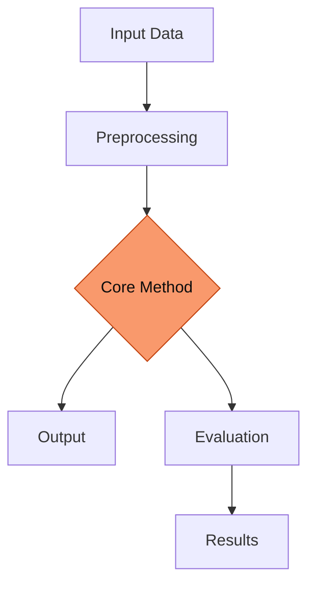
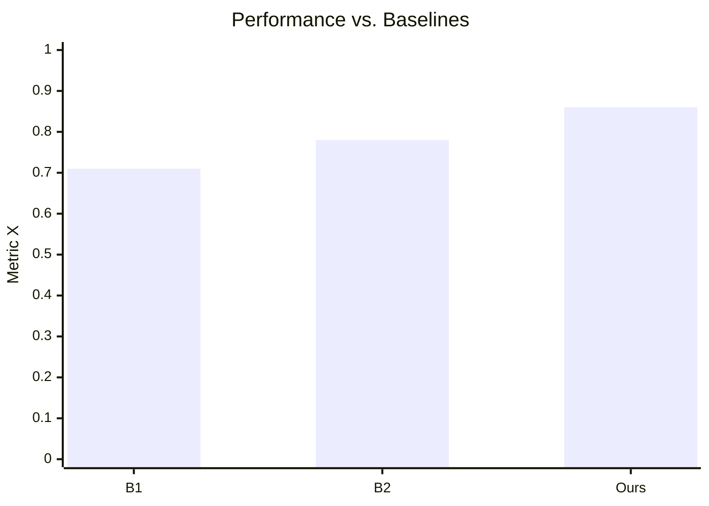

---
# Deck-wide configuration. See https://sli.dev/custom/#headmatter
theme: seriph
title: 'Thesis Title Goes Here: A Concise, Descriptive Subtitle'
titleTemplate: '%s — Thesis Defense'
info: |
  ## Thesis Defense
  Doctoral / Master's thesis defense presentation.

  Built with [Slidev](https://sli.dev).
author: Your Name
keywords: thesis,defense,research
# Apply unocss classes to the current slide
class: text-center
# https://sli.dev/features/drawing
drawings:
  persist: false
# slide transition: https://sli.dev/guide/animations#slide-transitions
transition: slide-left
# enable MDC Syntax: https://sli.dev/features/mdc
mdc: true
# Show line numbers in code blocks
lineNumbers: false
# Match the Zenith brand: dark (quantum-black) by default
colorSchema: dark
# Zenith uses a geometric grotesque (New Science); Space Grotesk is the closest
# freely-available analog. Headings forced to sans in style.css.
fonts:
  sans: Space Grotesk
  serif: Space Grotesk
  mono: Fira Code
# Aspect ratio of the slides
aspectRatio: 16/9
# Enable presenter mode notes
download: true
exportFilename: thesis-defense
hideInToc: false
---

# Thesis Title Goes Here

A Concise, Descriptive Subtitle

<div class="pt-12">
  <span class="text-xl">
    <b>Your Name</b>
  </span>
</div>

<div class="abs-bl m-6 text-sm opacity-70 text-left">
  <div>Advisor: Prof. Advisor Name</div>
  <div>Committee: Dr. A, Dr. B, Dr. C</div>
  <div>Department · University · {{ new Date().getFullYear() }}</div>
</div>

<div class="abs-br m-6 flex gap-2">
  <a href="https://github.com/yourname" target="_blank" class="slidev-icon-btn">
    <carbon:logo-github />
  </a>
</div>

<!--
Presenter notes:
- Welcome the committee and audience.
- Thank advisor and committee for their time.
- State your name and the title clearly.
- ~30 seconds. Take a breath before the next slide.
-->

---
transition: fade-out
layout: default
---

# Outline

<Toc minDepth="1" maxDepth="1" columns="2" />

<!--
Roadmap of the talk. Keep it brief — point to the major sections.
Tell them roughly how long you'll spend and when you'll take questions.
-->

---
layout: section
---

# 1. Motivation & Problem

The gap this thesis addresses

---
layout: default
---

# Motivation

<v-clicks>

- **The big picture.** Why does this domain matter? One sentence of context.
- **The pain point.** What problem do practitioners / researchers face today?
- **Why now.** What makes this problem tractable or urgent at this moment?

</v-clicks>

<div v-click class="mt-8 p-4 border-l-4 border-[#f9996c] bg-[#f9996c]/5 rounded">

> A short, memorable framing of the problem the audience should carry through the whole talk.

</div>

<!--
Spend real time here. The committee needs to feel the problem before they
care about the solution. Use a concrete example or anecdote if you have one.
-->

---
layout: two-cols
layoutClass: gap-8
---

# The Gap

<v-clicks>

**What exists today**

- Prior approach A — and its limitation
- Prior approach B — and its limitation
- Prior approach C — and its limitation

</v-clicks>

::right::

<div class="mt-14" />

<v-clicks>

**What's missing**

- The unsolved sub-problem
- The unmet requirement
- The unexplored regime

</v-clicks>

<div v-click class="mt-6 text-[#f9996c] font-semibold">
→ This thesis closes that gap.
</div>

---
layout: default
---

# Research Questions

<div class="grid grid-cols-1 gap-4 mt-6">

<div v-click class="p-4 rounded-lg bg-gray-400/10 flex gap-4 items-start">
  <div class="text-3xl font-bold text-[#f9996c]">RQ1</div>
  <div>
    <div class="font-semibold">First research question</div>
    <div class="opacity-70 text-sm">A one-line elaboration of what you investigate.</div>
  </div>
</div>

<div v-click class="p-4 rounded-lg bg-gray-400/10 flex gap-4 items-start">
  <div class="text-3xl font-bold text-[#f9996c]">RQ2</div>
  <div>
    <div class="font-semibold">Second research question</div>
    <div class="opacity-70 text-sm">A one-line elaboration of what you investigate.</div>
  </div>
</div>

<div v-click class="p-4 rounded-lg bg-gray-400/10 flex gap-4 items-start">
  <div class="text-3xl font-bold text-[#f9996c]">RQ3</div>
  <div>
    <div class="font-semibold">Third research question</div>
    <div class="opacity-70 text-sm">A one-line elaboration of what you investigate.</div>
  </div>
</div>

</div>

<!--
Keep RQs to 2-4. Each should map to a contribution and (ideally) a chapter.
Point at these again in the conclusion to show you answered them.
-->

---
layout: statement
---

# Thesis Statement

<div class="text-2xl leading-relaxed max-w-3xl mx-auto opacity-90">
State, in one or two sentences, the central claim your thesis defends.
This is the single thing the committee should remember.
</div>

---
layout: section
---

# 2. Background & Related Work

Standing on the shoulders of giants

---
layout: default
---

# Background

Key concepts the rest of the talk depends on.

<div class="grid grid-cols-2 gap-6 mt-6">

<div v-click>

### Concept A
A compact definition. Add a small diagram or equation if it clarifies.

$$ f(x) = \int_{-\infty}^{\infty} \hat{f}(\xi)\, e^{2\pi i x \xi} \, d\xi $$

</div>

<div v-click>

### Concept B
A compact definition. Tie it back to the problem you introduced.

</div>

</div>

<!--
Only include background the audience needs to follow YOUR contribution.
Resist the urge to teach the whole field.
-->

---
layout: default
---

# Related Work

| Approach | Year | Strength | Limitation |
|----------|------|----------|------------|
| Method A | 20XX | …        | …          |
| Method B | 20XX | …        | …          |
| Method C | 20XX | …        | …          |
| **This thesis** | **20XX** | **…** | **—** |

<div v-click class="mt-6 opacity-80">
Position your work against the closest competitors. The last row is you.
</div>

---
layout: section
---

# 3. Approach & Methods

How the problem is solved

---
layout: two-cols
layoutClass: gap-4
---

# Overview of Approach

<v-clicks>

- **Step 1** — what goes in
- **Step 2** — the core mechanism
- **Step 3** — what comes out

</v-clicks>

<div v-click class="mt-4 text-sm opacity-70">
The narrative thread: input → transformation → result.
</div>

::right::



<!--
Walk the diagram left-to-right / top-to-bottom. This is the spine of your
contribution — make sure every box is something you can defend in depth.
-->

---
layout: default
---

# Method: The Core Idea

<div class="grid grid-cols-5 gap-6">

<div class="col-span-3">

The key technical contribution, explained at the level your committee expects.

```python
def core_method(x, theta):
    """The essential algorithm in a few readable lines."""
    z = encode(x)
    for _ in range(theta.iterations):
        z = refine(z, theta)
    return decode(z)
```

</div>

<div class="col-span-2">

<v-clicks>

**Why it works**

- Property 1
- Property 2
- Property 3

</v-clicks>

</div>

</div>

---
layout: default
---

# Formalization

The problem, stated precisely:

<div class="my-6">

$$
\min_{\theta \in \Theta} \; \mathbb{E}_{(x,y)\sim\mathcal{D}}
\big[\, \mathcal{L}(f_\theta(x),\, y) \,\big]
\;+\; \lambda\, \mathcal{R}(\theta)
$$

</div>

<v-clicks>

- $\mathcal{L}$ — the loss capturing the task objective
- $\mathcal{R}$ — the regularizer encoding our prior / constraint
- $\lambda$ — controls the trade-off (ablated in §4)

</v-clicks>

<!--
If your committee is theory-leaning, be ready to derive or justify each term.
Know your assumptions cold — that's where the hard questions come from.
-->

---
layout: section
---

# 4. Experiments & Results

Evidence for the claims

---
layout: default
---

# Experimental Setup

<div class="grid grid-cols-3 gap-4 mt-4">

<div class="p-4 rounded-lg bg-gray-400/10">
  <div class="text-[#f9996c] font-semibold mb-2">Datasets</div>
  <ul class="text-sm opacity-80 list-disc list-inside">
    <li>Dataset A (N=…)</li>
    <li>Dataset B (N=…)</li>
  </ul>
</div>

<div class="p-4 rounded-lg bg-gray-400/10">
  <div class="text-[#f9996c] font-semibold mb-2">Baselines</div>
  <ul class="text-sm opacity-80 list-disc list-inside">
    <li>Baseline 1</li>
    <li>Baseline 2</li>
    <li>Ours</li>
  </ul>
</div>

<div class="p-4 rounded-lg bg-gray-400/10">
  <div class="text-[#f9996c] font-semibold mb-2">Metrics</div>
  <ul class="text-sm opacity-80 list-disc list-inside">
    <li>Metric X</li>
    <li>Metric Y</li>
  </ul>
</div>

</div>

<div v-click class="mt-6 text-sm opacity-70">
State hardware, hyperparameters, and that results are averaged over N seeds (±std).
Reproducibility matters — mention your code / data release.
</div>

---
layout: default
---

# Main Result

<div class="grid grid-cols-2 gap-8 items-center">

<div>

| Method | Metric X ↑ | Metric Y ↓ |
|--------|:----------:|:----------:|
| Baseline 1 | 0.71 | 0.42 |
| Baseline 2 | 0.78 | 0.35 |
| **Ours** | **0.86** | **0.21** |

<div v-click class="mt-4 text-[#f9996c] font-semibold">
+8 points over the strongest baseline.
</div>

</div>

<div v-click>



<div class="text-xs opacity-60 text-center mt-2">
Replace with your real figure in <code>public/images/</code>.
</div>

</div>

</div>

<!--
This is THE slide. Lead with the headline number. Be ready to explain the
metric, why the gain is significant (statistically and practically), and the
single most likely objection to it.
-->

---
layout: image-right
image: /images/placeholder-figure.svg
backgroundSize: contain
---

# Qualitative Results

<v-clicks>

- What the figure on the right shows
- The pattern the committee should notice
- How it corroborates the quantitative result

</v-clicks>

<div v-click class="mt-6 text-sm opacity-70">
Drop a real figure at <code>public/images/placeholder-figure.svg</code>
(or change the <code>image:</code> path in this slide's frontmatter).
</div>

---
layout: default
---

# Ablation Study

Which components actually matter?

| Variant | Metric X ↑ | Δ |
|---------|:----------:|:---:|
| Full model | **0.86** | — |
| − Component A | 0.80 | −0.06 |
| − Component B | 0.74 | −0.12 |
| − Both | 0.69 | −0.17 |

<div v-click class="mt-6 p-4 border-l-4 border-[#f9996c] bg-[#f9996c]/5 rounded">
Component B contributes most. Each piece earns its place — no dead weight.
</div>

<!--
Ablations are where you prove your design choices were deliberate, not lucky.
Expect "what if you removed X" — you've already answered it here.
-->

---
layout: section
---

# 5. Discussion

What it means, and where it breaks

---
layout: two-cols
layoutClass: gap-8
---

# Limitations

<v-clicks>

- **Scope.** Where the method does *not* apply.
- **Assumptions.** What must hold for results to transfer.
- **Cost.** Compute / data / time trade-offs.

</v-clicks>

::right::

<div class="mt-14" />

# Threats to Validity

<v-clicks>

- **Internal** — confounds you controlled for
- **External** — generalization beyond your datasets
- **Construct** — do your metrics measure what you claim?

</v-clicks>

<!--
Naming limitations first DISARMS the committee. If you raise it, it's a
strength; if they raise it, it's a weakness. Own them confidently.
-->

---
layout: default
---

# Contributions

Mapping back to the research questions.

<div class="grid grid-cols-1 gap-3 mt-4">

<div v-click class="flex gap-4 items-center p-3 rounded-lg bg-gray-400/10">
  <carbon:checkmark-filled class="text-[#f9996c] text-2xl shrink-0" />
  <div><b>C1 (→ RQ1):</b> The first concrete contribution and its evidence.</div>
</div>

<div v-click class="flex gap-4 items-center p-3 rounded-lg bg-gray-400/10">
  <carbon:checkmark-filled class="text-[#f9996c] text-2xl shrink-0" />
  <div><b>C2 (→ RQ2):</b> The second concrete contribution and its evidence.</div>
</div>

<div v-click class="flex gap-4 items-center p-3 rounded-lg bg-gray-400/10">
  <carbon:checkmark-filled class="text-[#f9996c] text-2xl shrink-0" />
  <div><b>C3 (→ RQ3):</b> The third concrete contribution and its evidence.</div>
</div>

</div>

---
layout: default
---

# Future Work

<div class="grid grid-cols-2 gap-6 mt-6">

<div v-click class="p-4 rounded-lg border border-gray-400/30">
  <div class="font-semibold text-[#f9996c]">Short term</div>
  <p class="text-sm opacity-80 mt-2">Immediate extensions / low-hanging fruit.</p>
</div>

<div v-click class="p-4 rounded-lg border border-gray-400/30">
  <div class="font-semibold text-[#f9996c]">Long term</div>
  <p class="text-sm opacity-80 mt-2">The ambitious direction this opens up.</p>
</div>

</div>

---
layout: center
class: text-center
---

# Conclusion

<div class="max-w-2xl mx-auto mt-6 text-left">

<v-clicks>

- **Problem:** the gap we set out to close
- **Approach:** the core idea, in one line
- **Result:** the headline finding
- **Impact:** why it matters beyond this thesis

</v-clicks>

</div>

<div v-click class="mt-10 text-xl text-[#f9996c] font-semibold">
The thesis statement holds. ✓
</div>

<!--
Land the plane. Restate the thesis statement and confirm you've supported it.
End cleanly — don't trail off. A confident final sentence sets the Q&A tone.
-->

---
layout: center
class: text-center
---

# Thank You

Questions & Discussion

<div class="pt-8 opacity-70 text-sm">
  <div>Your Name · your.email@university.edu</div>
  <div>Slides, code & data: github.com/yourname/thesis</div>
</div>

<!--
Pause. Smile. Take questions one at a time. It's fine to say
"that's a great question, let me think" — and to use the backup slides.
-->

---
layout: section
---

# Backup Slides

Anticipated questions

---
layout: default
hideInToc: true
---

# Backup: Anticipated Question 1

Prepare full answers to the questions you *know* are coming — extra derivations,
larger result tables, additional baselines, hyperparameter sensitivity, etc.

```text
Keep one backup slide per likely question. Jump here directly with the
slide-overview (press `o`) or by typing the slide number during Q&A.
```

---
layout: default
hideInToc: true
---

# Backup: Additional Results

| Setting | Metric X | Metric Y | Notes |
|---------|:--------:|:--------:|-------|
| Config 1 | … | … | … |
| Config 2 | … | … | … |
| Config 3 | … | … | … |

<div class="mt-6 opacity-70 text-sm">
Detailed numbers you'd cite if pressed, but that don't belong in the main flow.
</div>

---
layout: end
hideInToc: true
---
