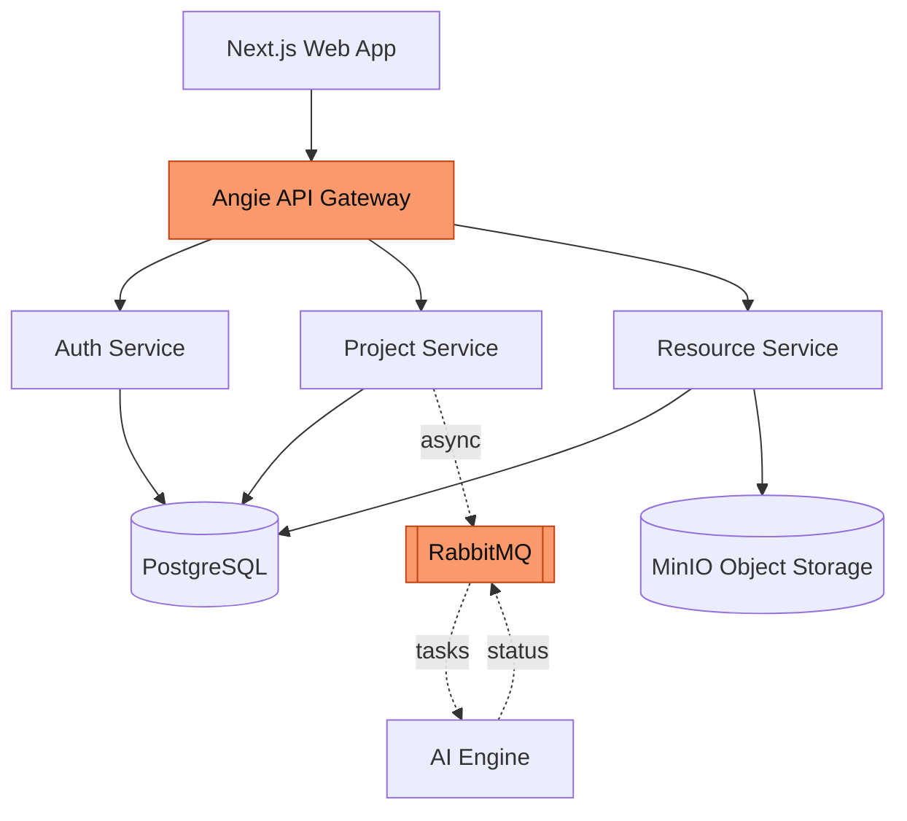
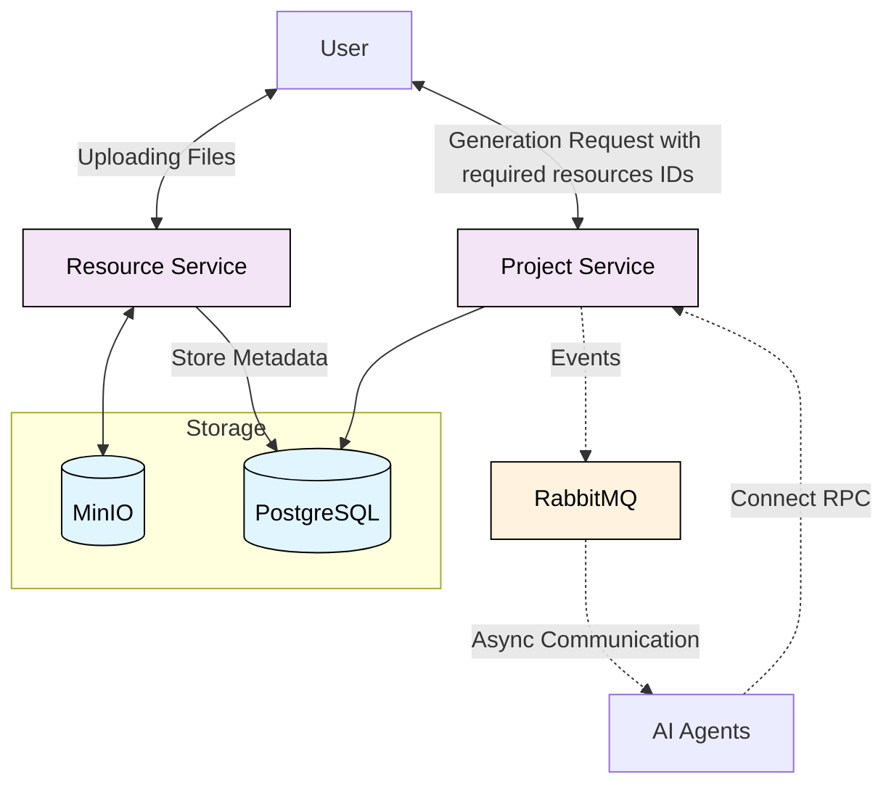
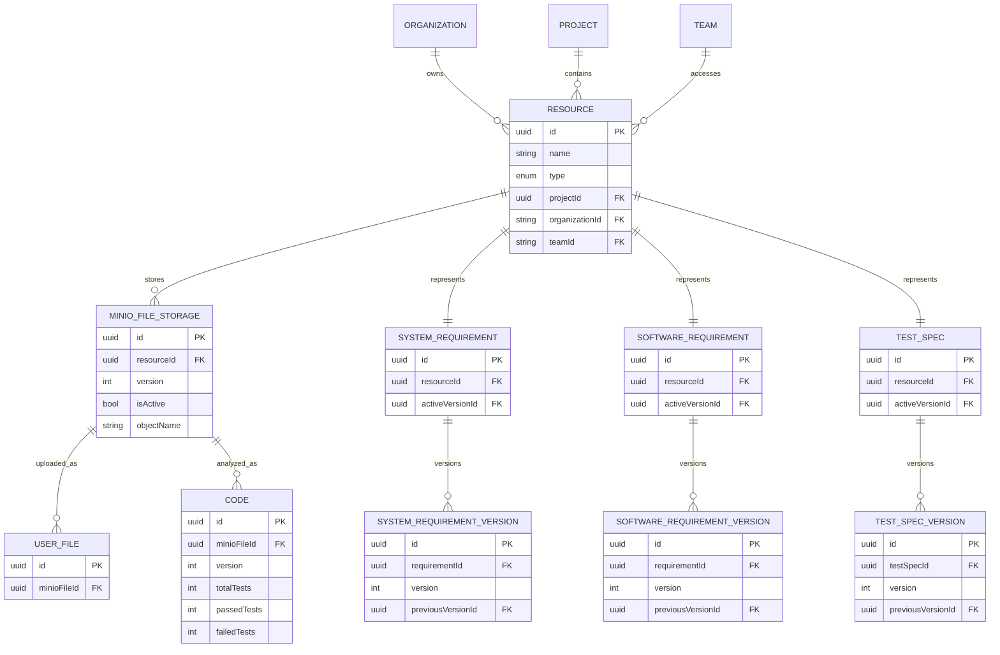
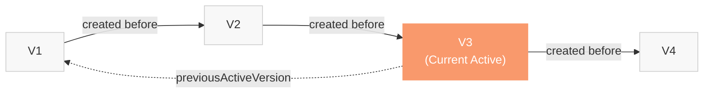
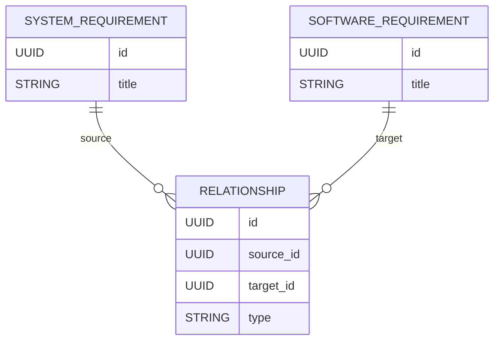
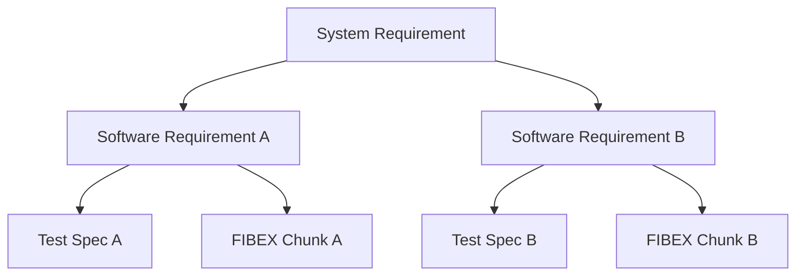
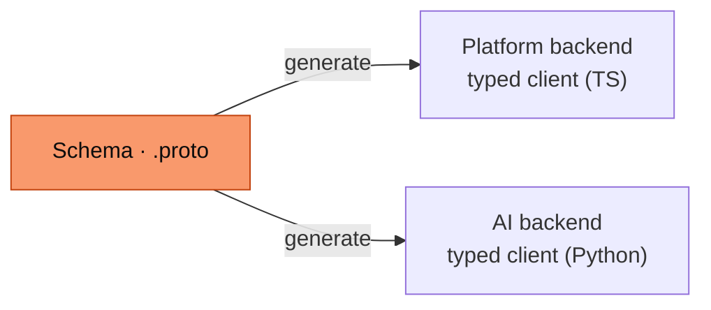
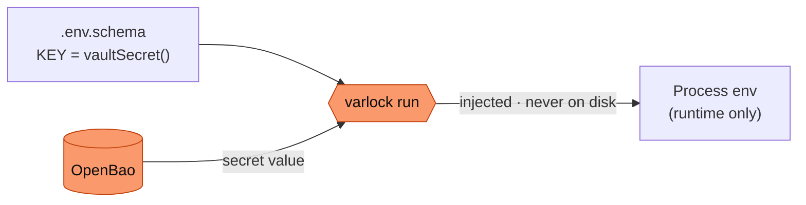
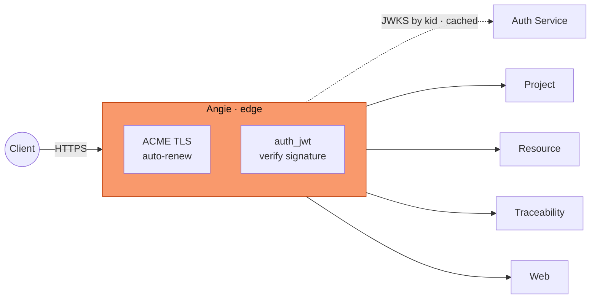

---
# Deck-wide configuration. See https://sli.dev/custom/#headmatter
theme: seriph
title: "Web-based AI-powered SDLC Automation Platform"
titleTemplate: "%s — CairoMotive"
info: |
  ## A Platform for AI-Assisted Software Engineering
  Orchestrating autonomous AI agents across the V-Cycle (SWE.1 / SWE.4 / SWE.6)
  with cybersecurity (TARA, SECO) and functional safety (HARA, FMEA, FTA) analysis.

  Built with [Slidev](https://sli.dev).
author: CairoMotive
keywords: v-cycle,aspice,iso26262,iso21434,ai-agents,cairo-motive
# Apply unocss classes to the current slide
class: text-center
# https://sli.dev/features/drawing
drawings:
  persist: false
# slide transition: https://sli.dev/guide/animations#slide-transitions
transition: slide-left
# enable MDC Syntax: https://sli.dev/features/mdc
mdc: true
# Show line numbers in code blocks
lineNumbers: false
# Match the product brand: dark (quantum-black) by default
colorSchema: dark
# The product uses a geometric grotesque (New Science); Space Grotesk is the closest
# freely-available analog. Headings forced to sans in style.css.
fonts:
  sans: Space Grotesk
  serif: Space Grotesk
  mono: Fira Code
# Aspect ratio of the slides
aspectRatio: 16/9
# Enable presenter mode notes
download: true
exportFilename: defense
hideInToc: false
---

# Web-based AI-powered SDLC Automation Platform

A Platform for AI-Assisted Software Engineering across the V-Cycle

  

  
Supervised by Prof. Dr. Hazem Abbas &amp; Eng. Mahmoud Soliman

  
CairoMotive · {{ new Date().getFullYear() }}

<!--
Presenter notes:
- Welcome the audience.
- One line: the platform brings AI agents to the automotive V-Cycle, with flexible
  deployment — from managed cloud to fully self-hosted — so teams control where
  their code and requirements live.
- State what the talk covers: team, problem, architecture, the V-Cycle
  workspaces, safety & security, and results.
- ~30 seconds.
-->

---
transition: fade-out
---

# Outline

1Team Members

2Introduction

3System Architecture

4The V-Cycle Workspaces

5Safety &amp; Security

6DevOps &amp; Infrastructure

7Results

<!--
Roadmap of the talk. Point to the major sections and roughly how long each takes.
-->

---

# 1. Team Members

| Name                     | ID      |
| ------------------------ | ------- |
| Farah Abdelrahman Kamalo | 2000901 |
| Khalid Ayman Alansary    | 2100259 |
| Maryam Yasser Mohammed   | 2100730 |
| Mohamed Ashraf Mohamed   | 2100514 |
| Omar Abdelgaber Elsayed  | 2101048 |
| Salma Hamed Shaaban      | 2100636 |

  
Supervised by Prof. Dr. Hazem Abbas &amp; Eng. Mahmoud Soliman

  
In collaboration with CairoMotive

<!--
Introduce the team briefly. Mention the CairoMotive collaboration and the
supervising staff.
-->

---
layout: section
---

# 2. Introduction

What we built, and why it matters

---

# The Context

<v-clicks>

- **The V-Cycle** is the dominant paradigm in automotive software, formalized by **ASPICE** — every development phase (SWE.1–3) has a matching verification phase (SWE.4–6).
- Standards like **ISO 26262** (functional safety) and **ISO 21434** (cybersecurity) mandate rigorous **traceability** between requirements, design, code, and tests.
- **LLM-based AI agents** can now plan, generate, and validate engineering artifacts — but most platforms are **rigid SaaS** with no control over deployment.

</v-clicks>

> Organizations working with **proprietary code and confidential requirements** need **control over where artifacts and inference run** — and the option to keep them inside their own boundary.

<!--
Set the stage: V-Cycle + standards demand traceability; AI can help; but teams
need control over deployment and data governance. That flexibility is what the
platform provides.
-->

---

# The Problem

<v-clicks>

- Generating test cases and requirements from documents is **high-effort** and must stay synchronized as requirements evolve.
- Manual work leads to **inconsistent interpretation**, **incomplete coverage**, and **brittle traceability** between a test and its originating requirement.
- Integrating AI into internal workflows raises **data-governance** concerns — teams need a say in **where** artifacts are stored and inference runs.

</v-clicks>

> **The need:** a platform that integrates AI agents into the software lifecycle, maintains traceability, and can be deployed flexibly — from managed cloud services to fully self-hosted.

<!--
Three pain points. Land the framing: the value is rigor + automation + deployment
flexibility. Cloud services (e.g. LLM inference) are used by default, but every
component can be swapped for a self-hosted equivalent when policy demands it.
-->

---

# Objectives & Scope

**Objectives**

<v-clicks>

- A **self-hosted** platform that orchestrates AI agents for SE tasks
- A **service-based** architecture with a shared data layer for consistency
- **End-to-end type-safe** APIs (with language-agnostic OpenAPI)
- **Asynchronous** AI processing via a message broker
- **Containerized**, reproducible deployment + CI

</v-clicks>

**Scope — three V-Cycle stages**

<v-clicks>

- **SWE.1** — Software Requirements Analysis
- **SWE.4** — Software Unit Verification
- **SWE.6** — Software Qualification Testing

Plus security & safety workspaces:

- **TARA · SECO** — ISO 21434 cybersecurity
- **HARA · FMEA · FTA** — ISO 26262 functional safety

</v-clicks>

<!--
Objectives on the left, scope on the right. Stress that the AI engine itself is
an external service that consumes queued tasks — the platform orchestrates it.
-->

---
layout: section
---

# 3. System Architecture

How the platform is put together

---

# Architecture — Service-Based

A **service-based architecture**: independently deployable, coarse-grained domain services over a **single shared data layer**.

<v-clicks>

**Why this style**

- Distributed, but far less complex/costly than full microservices
- Shared **PostgreSQL** ⇒ SQL joins, no data duplication
- Shared layer enables **end-to-end type safety**
- Gateway unifies entry; AI engine stays **external & async**

</v-clicks>

<!--
Pragmatic middle ground: separation of concerns at the service/API layer, but a
single shared data layer for consistency and type safety. The AI engine is
decoupled behind RabbitMQ.
-->

---

# Core Components

| Component               | Responsibility                                       |
| ----------------------- | ---------------------------------------------------- |
| **Web App** (Next.js)   | User interface and client-side workflows             |
| **API Gateway** (Angie) | Unified entry point, JWT validation, rate limiting   |
| **Auth Service**        | Authentication, users, organizations, RBAC           |
| **Project Service**     | Projects, membership, AI request orchestration       |
| **Resource Service**    | File upload/download, storage abstraction            |
| **PostgreSQL**          | Shared relational database                           |
| **MinIO**               | Shared S3-compatible object storage                  |
| **RabbitMQ**            | Asynchronous AI task queue                           |

<!--
Walk the table top to bottom. The gateway does cross-cutting concerns so the
services stay focused. Resource service hides storage behind presigned URLs.
-->

---
layout: default
---

# Technology Stack

**Language & Runtime**

- TypeScript (full-stack)
- Bun runtime
- Shared code across FE/BE

**API & Data**

- oRPC + OpenAPI contracts
- Drizzle ORM
- Zod schema validation
- Protobuf + ConnectRPC

**Frontend**

- Next.js (App Router)
- TanStack Query
- Tailwind CSS
- Component library

**Auth & Gateway**

- JWT-based auth
- Angie gateway
- RBAC + multi-tenancy

**Infra & DevOps**

- Docker Compose
- Dev Containers
- Turborepo monorepo
- GitHub Actions CI

**Observability**

- Structured logging
- Centralized aggregation
- Langfuse AI tracing
- Health checks

One type-safe contract from database → backend → frontend.

<!--
The through-line: a single TypeScript type system, enforced at every boundary by
oRPC, Drizzle, and Zod. Protocol Buffers carry the contract across the language
boundary to the AI engine.
-->

---
layout: section
---

# 4. Service Communication

---
layout: section
---

### Request/Response flow

- Upload files via the Resource Service.
- Store files in MinIO and metadata in the database.
- Trigger the AI pipeline through the Project Service using file IDs.
- Dispatch processing requests to AI agents via RabbitMQ.
- Receive generated results through ConnectRPC.
- Persist the results in the database.

---
layout: section
---

# 5. Storage & Version Management

File Lifecycle Management using MinIO

---
layout: default
---

# Version Control

MinIO versioning allows multiple versions of the same object to coexist.

### How it works

- Initial upload creates the first version
- Each update creates a new version
- Previous versions are preserved
- Every version receives a unique **Version ID**
- The most recent version is marked as **Latest**

 

### Versioning Namespace

Versioning is scoped to a specific **user-project namespace**, ensuring that file versions are managed independently for each user within each project.

---
layout: two-cols
---

# Object Retrieval

### Latest Version

- Returned by default
- No version ID required

 

### Specific Version

- Client provides the version ID
- MinIO returns the requested revision

 

### Benefits

- File history preservation
- Recovery of previous revisions
- Protection against accidental overwrites
- Traceability of changes

::right::

  

<!--
This is what makes the platform responsive and scalable. The protobuf contract
gives type safety even across the TS ↔ AI-engine boundary. Real-time UI feedback
comes from per-SWE conditional polling.
-->

---
layout: section
---

# Database Redesign 
A complete architectural redesign — from JSON-centric monolith to a scalable, multi-tenant, resource-centric platform.

---
layout: default
---

# The Database Was Holding Us Back.

<v-clicks>

> **JSON-Based Resource Storage**   - Every retrieval required preprocessing to identify the resource type and extract the required fields.   - Increased application complexity and reduced efficiency.

</v-clicks>

<v-clicks>

> **Lack of Structured Storage:**    - Artifacts had no relationships, no validation, no traceability in the database.

</v-clicks>

<v-clicks>

> **Monolithic Resource Schema:**   - Supporting new artifact types required schema modifications.  - Large numbers of nullable columns accumulated over time.   - Increased maintenance effort and risk of breaking existing functionality.

</v-clicks>

---
layout: default
---

# Resource-Centric Architecture

  

    

    A generic Resource entity was introduced to represent all engineering artifacts.
    

    

    <h4>Design Principles</h4>
    <b>Inheritance</b> 
      - Common metadata defined once in the Resource entity & shared across all types 
      <b>Polymorphism</b> 
      - Each artifact stores only what makes it unique. 
      - Different resource types are handled through a common abstraction. 
    

    
    
  

  

<ZoomPanContainer title="Resource-Centric Diagram" hint="Drag to move · wheel to zoom · Esc resets" :initial-scale="0.85" :min-scale="0.45" :max-scale="2.4">

</ZoomPanContainer>

  

---
layout: default
---

# SaaS and Multi-Tenant Design

  

  
Every entity in the database is scoped to an Organization at the schema level.  
  <b> Logical Isolation</b> 
  Tenant data is separated by design, not by convention.  
  <b>Security</b> 
  No cross-tenant data leakage enforced at the schema level.  
  <b>SaaS Scalability</b> 
  Add organizations without touching the core architecture.
  

  

  

  

  <b class="text-lg font-semibold">
    Access Control Structure
  </b>

  

    <!-- Organization -->
    

      Organization
    

    

    <!-- Teams -->
    

      Teams
    

    

    <!-- Projects -->
    

      Projects
    

    

    <!-- Roles -->
    

      Roles &amp; Access
    

  

  
    Flexible ownership model for collaborative engineering environments.
  

---
layout: default
---

# Versioning and History

  

  <h4>Immutable Versioning</h4>

  Instead of updating records in place, every artifact type has a dedicated version entity. Every change is recorded, every state is recoverable.

  <h4>Benefits</h4>

  <ul class="list-disc list-inside space-y-1">
    <li>Full auditability</li>
    <li>Complete history on every artifact</li>
    <li>Rollback capability</li>
  </ul>

  

  

  

      SystemRequirement 
    &nbsp;&nbsp;└── SystemRequirementVersion 
    SoftwareRequirement 
    &nbsp;&nbsp;└── SoftwareRequirementVersion 
    TestSpec 
    &nbsp;&nbsp;└── TestSpecVersion
    

  

---
layout: default
---

# Traceability and Knowledge Graph Support

  

    

      <h4 class="text-base font-semibold mb-1">Relationship-Based Architecture</h4>
      
Dedicated relationship entities connect engineering artifacts.

    

    

      <h4 class="text-base font-semibold mb-1">Can Support Knowledge Graph Integration</h4>
      
The same relationships used for traceability are also used by the Knowledge Graph Visualizer.

      
Benefits:

      <ul class="list-disc list-inside mt-1 space-y-1">
        <li>Single source of truth</li>
        <li>No separate graph database</li>
        <li>No data synchronization issues</li>
        <li>Real-time visualization of engineering relationships</li>
      </ul>
    

  

  

  

---
layout: section
---

# User Management Service

---
transition: fade-out
---

Multi-tenant accounts replacing the single-account initial version

**Platform-level roles**

<v-clicks>

- Every account holds a **platform-level role** — either **Site Admin** or **User**
- A **Site Admin** has authority across the entire platform
- A **User** belongs to one or more **Organizations**

</v-clicks>

An <b>Organization</b> represents a company — it is the primary multi-tenancy boundary in the system.

**Organization-level roles**

  Owner
  
Full control over the organization

  Org Admin
  
Manages members and their roles within the org

  Member
  
Standard participant with scoped access

  Custom Roles
  
Configurable per organization

<!--
Two role scopes: platform-level (Site Admin / User) and organization-level
(Owner / Org Admin / Member / Custom). Each user carries both. Organizations
are the multi-tenancy boundary.
-->

---

# Role-Based Access Control (RBAC)

Each user's role determines exactly what actions they are authorized to perform — no more, no less.

**Site Admin** platform-wide authority

<v-clicks>

- Create new **organizations** on the platform
- Add **members or admins** to any organization
- Assign and modify **platform-level roles**
- Full platform-level configuration

</v-clicks>

**Org Admin** organization-scoped authority

<v-clicks>

- Add new **members** to their organization
- Assign and modify each member's **organization role**
- View and manage the organization's **roster**
- Cannot access or affect **other organizations**

</v-clicks>

Access is enforced at <b>API layer</b> — roles are checked on every request, not just in the UI.

<!--
RBAC: two roles, two scopes. Site Admin acts globally; Org Admin is strictly
scoped to their own organization. Enforcement is at the API layer, not the UI.
-->

---
layout: section
---

# 6. The V-Cycle Workspaces

SWE.1 · SWE.4 · SWE.6

---
layout: section
---

# Flow Redesign
From rigid wizards to flexible workspaces

---

# Application Flow — Old vs New

**Previous Flow (v1)**

- 5-step project creation wizard
- Choose SWE stage (only SWE.6 available)
- Upload software requirements as last step
- Redirected directly to SWE.6 workspace
- Single workspace for test spec generation
- File management at project level (separate page)
- Traceability matrix in its own standalone page

**Current Flow (v2)**

- 2-step project creation: details → team members
- Redirected to **Project Overview** — central hub with V-Cycle navigation
- Inline editing of project info (name, description)
- Navigate to any SWE: **SWE.1 · SWE.4 · SWE.6**
- **Tab-based** workspaces per SWE with per-SWE file management
- Upload mandatory docs → Generate → Live status
- Traceability matrix in a tab within each SWE

**Key shift:** Project creation is lightweight (2 steps). Document management and AI generation are now **per-SWE**, with each workspace providing its own set of tabbed views tailored to the stage.

<!--
Walk through the evolution: the old flow was rigid (5 steps, single SWE), the new
flow is flexible — lightweight project creation, a project overview hub, and
independent SWE workspaces with their own file management and AI generation.
-->

---
layout: section
---

# SWE.1 — Software Requirements Analysis

---
transition: view-switch
---

# SWE.1 — File Management

  

    <SWEPills swe="swe1" active="files" />
  

<Transition name="slide-fade" mode="out-in" appear>

  
Per-SWE Document Upload

  <ul class="list-disc list-inside opacity-80 space-y-1 mt-2 text-sm">
    <li>Users are prompted to upload required documents for the active SWE stage</li>
    <li>Compliance standards and supplementary files can be added via designated upload zones</li>
    <li>Files are automatically flagged with their corresponding category upon upload</li>
    <li>Required and optional uploads are clearly distinguished in the interface</li>
    <li>Mandatory documents are enforced — users cannot proceed until the required document is uploaded</li>
  </ul>

  

  
File Table Management

  <ul class="grid grid-cols-2 gap-x-6 gap-y-1 text-sm opacity-80 mb-4 list-disc list-inside">
    <li>Files displayed in a structured table with metadata</li>
    <li>Files can be removed with a single click</li>
    <li>Additional documents can be uploaded anytime</li>
    <li>File management scoped per SWE stage</li>
  </ul>
  

</Transition>

<!--
Click 1: docs-to-be-uploaded screenshot. Click 2: switches to project-files screenshot and file-table text.
-->

---
transition: view-switch
---

# SWE.1 — Software Requirements

  

    <SWEPills swe="swe1" active="software-requirements" />
  

<SWE1Demo />

<!--
Demo: collapsed list → expand to reveal generated sw reqs, then click a refines
link to walk the traceability chain. Open a card's details modal, change status,
add a review comment.
-->

---

# SWE.1 — Traceability Matrix

  

    <SWEPills swe="swe1" active="traceability" />
  

**Per-SWE Traceability**

<ul class="list-disc list-inside opacity-80 space-y-1 mt-2 text-sm">
  <li>Maps software → system requirements with reference IDs for traceability</li>
  <li>Automatic coverage gap detection — flags system requirements missing software requirements</li>
</ul>

  

<!--
Traceability was initially a standalone page (SWE.6 only). With multiple SWEs,
each workspace has its own Traceability Matrix tab so users see the relevant
trace chain without leaving context.
-->

---
layout: section
---

# SWE.4 — Software Unit Verification

---
transition: view-switch
---

# SWE.4 — Code Upload

  

    <SWEPills swe="swe4" active="unit-tests" />
  

<Transition name="slide-fade" mode="out-in" appear>

  
Upload Code

  <ul class="list-disc list-inside opacity-80 space-y-1 mt-2 text-sm">
    <li>Upload C/C++ source code via zip or GitHub import</li>
    <li>Uploaded files appear in a file tree and can be viewed in the built-in code viewer</li>
  </ul>

  

</Transition>

---
transition: view-switch
---

# SWE.4 — Unit Tests

  

    <SWEPills swe="swe4" active="unit-tests" />
  

<SWE4Demo startStep="generate" />

---

# SWE.4 — Coverage Report

  

    <SWEPills swe="swe4" active="unit-tests-coverage" />
  

**Coverage Metrics**

<ul class="list-disc list-inside opacity-80 space-y-1 mt-2 text-sm">
  <li>Displays overall percentage of passed tests</li>
  <li>Shows line, branch, and function coverage percentages</li>
  <li>Contains detailed test results with pass/fail status for each generated test</li>
</ul>

  

<!--
Demo: generate tests, switch to the Tests Coverage Report tab to see coverage
metrics, then open the file tree to browse generated tests.
-->

---
layout: section
---

# SWE.6 — Software Qualification Testing

---
transition: view-switch
---

# SWE.6 — File Management

  

    <SWEPills swe="swe6" active="files" />
  

<Transition name="slide-fade" mode="out-in" appear>

  
Per-SWE Document Upload

  <ul class="list-disc list-inside opacity-80 space-y-1 mt-2 text-sm">
    <li>Users are prompted to upload required documents for the active SWE stage</li>
    <li>Compliance standards and supplementary files can be added via designated upload zones</li>
    <li>Files are automatically flagged with their corresponding category upon upload</li>
    <li>Required and optional uploads are clearly distinguished in the interface</li>
    <li>Mandatory documents are enforced — users cannot proceed until the required document is uploaded</li>
  </ul>

  

  
File Table Management

  <ul class="grid grid-cols-2 gap-x-6 gap-y-1 text-sm opacity-80 mb-4 list-disc list-inside">
    <li>Files displayed in a structured table with metadata</li>
    <li>Files can be removed with a single click</li>
    <li>Additional documents can be uploaded anytime</li>
    <li>File management scoped per SWE stage</li>
  </ul>
  

</Transition>

<!--
Click 1: docs-to-be-uploaded screenshot. Click 2: switches to project-files screenshot and file-table text.
-->

---
transition: view-switch
---

# SWE.6 — Test Specifications

  

    <SWEPills swe="swe6" active="test-specs" />
  

<SWE6Demo />

<!--
Demo: click generate, test specs appear streamed in.
-->

---

# SWE.6 — Traceability Matrix

  

    <SWEPills swe="swe6" active="traceability" />
  

**Per-SWE Traceability**

<ul class="list-disc list-inside opacity-80 space-y-1 mt-2 text-sm">
  <li>Maps test specifications → software requirements with reference IDs for traceability</li>
  <li>Automatic coverage gap detection — flags requirements missing test specifications</li>
</ul>

  

<!--
Same evolution story as SWE.1: the traceability matrix was a standalone page,
now it's a contextual tab within each SWE workspace.
-->

---
transition: view-switch
---

# SWE.6 — Communication Matrix

  

    <SWEPills swe="swe6" active="communication-matrix" />
  

---
transition: view-switch
---

# SWE.6 — Requirement Validation

  

    <SWEPills swe="swe6" active="validation" />
  

---
layout: section
---

# 6. Safety & Security

Extending the platform's scope — ISO 21434 & ISO 26262

---

# Cybersecurity — TARA

Threat Analysis &amp; Risk Assessment · ISO/SAE 21434

  Upload
  →
  Validate · required sections
  →
  Configure · detects ECU, suggests defaults
  →
  you edit
  →
  Generate

Validation, configuration and generation are each an AI request, run as a <b>chain</b> — the engineer reviews and edits the configs in between.

<v-clicks>

- **Full ISO/SAE 21434 chain** — assets, threat scenarios, attack paths, damage and feasibility, through to the derived **cybersecurity goals**, each stage on its own tab
- **Forward and backward trace links** relate each threat to its asset, attack path, risk and goal; selecting a link navigates to the referenced entry
- **Editable throughout**, with the full report exportable to **Excel**

</v-clicks>

  <TaraDemo />
  

  Switch between the three tabs, then follow a trace link — the report navigates to the linked entry and highlights it.
  

<!--
TARA workspace: the starter step bar is the human-in-the-loop chained flow —
validation gate (required sections, pass/fail), then ECU-specific configs the
user edits, then AI generation. Bullets + demo are the resulting report. The
analysis is produced by the AI engine; this is the UI and the workflow around it.
-->

---

# Cybersecurity — SECO

Security Concept · ISO/SAE 21434

<v-clicks>

- **Document-style editor** — narrative sections (introduction, scope, system description) alongside the goals and measures tables, with a **contents** sidebar
- Records cybersecurity **goals and security measures**, with **goal ↔ measure coverage** matrices relating the two
- Exports to a formatted **Word .docx** generated from a standardized template (cover page, contents and tables)

</v-clicks>

  <SecoDemo />
  

  Scroll the document and the contents track the current section; selecting a section navigates to it.
  

A <b>SECO</b> report can be generated from a completed <b>TARA</b> — carrying over its cybersecurity goals and system-description document — or independently, from its own uploaded inputs.

<!--
SECO workspace: bullets + the document demo side by side. Close with the link to
TARA — a SECO can build on a finished TARA or run standalone.
-->

---

# Functional Safety — ISO 26262

Three <b>separate</b> workspaces — but a deliberately <b>shared UI and flow</b>:

Upload → <b>scope review*</b> → <b>generate</b> (re-run anytime) → multi-view report → <b>export</b>

  
HARA

  
Hazard Analysis &amp; Risk Assessment

  
A workspace to explore the hazard analysis — safety goals grouped by <b>ASIL</b> in a hierarchy view, or the full assessment as tables, with the ISO 26262 reference on hand.

  
FTA

  
Fault Tree Analysis

  
Three linked views of the fault tree — the <b>tree</b> itself, a <b>cross-ASIL</b> coverage audit, and <b>minimal cut sets</b> — to follow how failures lead to a hazard.

  
FMEA

  
Failure Mode &amp; Effects Analysis

  
An interactive <b>worksheet</b> across three views — <b>Risk Overview</b>, <b>Failure Detail</b>, and <b>Action Summary</b> — with filtering and inline review of each failure mode.

Shared shell across all three — dropzone, progress polling, a segmented view-toggle, and a slide-out legend / reference sheet — so only the analysis inside differs.

* Scope review is an FTA &amp; FMEA step — HARA generates straight from the upload.

<!--
Three separate workspaces that share components, so the UI and flow feel the same.
Cards: HARA (ASIL via S×E×C, derives safety goals), FTA (cut sets + cross-ASIL),
FMEA (RPN + Action Priority). Footnotes carry the two real differences: scope
review is FTA/FMEA only, and HARA has no export.
-->

---

# Functional Safety — Live View

HARA, FTA and FMEA — three workspaces framed by one shared shell

  <FusaDemo />

<!--
The demo is the argument: the workspace switcher plus the per-workspace view toggle
show three separate analyses sharing one UI. Example rows are illustrative.
-->

---
layout: default
---

# Cross-Service Communication

The <b>platform backend</b> (TypeScript) and the <b>AI backend</b> (Python) speak different languages — the stack is chosen for a <b>type-safe contract</b> across that boundary.

  
Protocol Buffers

  
The contract

  
One language-neutral schema as the single source of truth — generated into typed clients for both backends, giving <b>compile-time safety</b> across the language boundary. Versioned and backward-compatible.

  
ConnectRPC

  
Synchronous calls

  
Server and client are generated from that same schema and run over ordinary <b>HTTP/1.1</b> — no hand-written REST glue or manual validation, and no drift between the two services.

  
Message broker

  
Asynchronous jobs

  
AI generation is long-running, so it's <b>decoupled</b> behind a queue: jobs survive restarts, retry on failure, and let AI workers <b>scale out</b> — the platform never blocks on a request.

Why not plain REST / JSON? With two different-language backends, a schema-first generated contract removes a whole class of integration bugs.

<!--
This slide is about the technology decisions, not the request flow. Three
choices: (1) Protocol Buffers as a language-neutral, schema-first contract
generated for both backends — compile-time safety across TypeScript and Python.
(2) ConnectRPC for synchronous calls, generated from that same schema, over
plain HTTP/1.1. (3) a message broker for long-running AI jobs, so the platform
stays responsive and AI workers scale independently. The thread: one schema, no
drift, fewer integration bugs.
-->

---
layout: section
---

# 8. DevOps & Infrastructure

Deployment, tooling, and observability

---

# Secrets Management

Two layers, split by audience — runtime infrastructure creds vs. developer & app secrets.

**Runtime — Docker Compose secrets**

<v-clicks>

- Mounted as **files** at `/run/secrets/…` — never baked into images or env
- Postgres, MinIO, and Better-Auth credentials
- Services read them via the `*_FILE` convention

</v-clicks>

**Dev & app — OpenBao + varlock**

<v-clicks>

- LLM-provider keys live in a central **OpenBao** server
- `varlock` resolves `vaultSecret()` placeholders at **command runtime** — never written to disk
- `bao login` authenticates each developer

</v-clicks>

<!--
Two distinct mechanisms the deck used to lump together. Compose secrets handle
the infra credentials at runtime as mounted files. OpenBao + varlock distribute
the LLM keys to developers: the .env.schema only declares vaultSecret(), and
varlock pulls the real value from OpenBao when a command runs — nothing sensitive
is ever written to disk.
-->

---
layout: default
---

# API Gateway & Edge — Angie

A single <b>Angie</b> config is the platform's front door — three jobs at the edge:

  
Reverse proxy
Path-based routing to the auth, project, resource, traceability &amp; storage upstreams

  
TLS via ACME
Built-in Let's Encrypt client auto-issues &amp; renews certs — no certbot sidecar

  
JWT validation
Built-in module verifies signatures at the edge — bad tokens never reach a service

The JWKS signing keys are fetched once and cached (keyed by the token's <code>kid</code>), so per-request validation adds no round-trip to the auth service.

<!--
Angie (an nginx fork) does three things from one config. Reverse proxy: routes
/api/* to the right service. ACME: the built-in Let's Encrypt client issues and
renews TLS certs automatically. JWT: the built-in auth_jwt module validates the
token signature at the edge using the auth service's JWKS, cached by kid so
there's no per-request lookup. Unauthenticated routes (login, JWKS) stay open.
-->

---
layout: default
---

# Quality Gates & Deployment

Two automated PR checks post their results straight onto the pull request:

AI Pipeline Preview

Runs the <b>real pipeline</b> on a fixed sample requirements doc against the live LLM, then <b>upserts a bot comment</b> — reviewers see the <b>behavioural change</b>, not just the code diff.

  

    🤖github-actionsbot · pipeline preview · example
  

  

    
Sample input: <code>reqTest2.docx</code>

    
<b>12</b> specs · <b>7</b> requirements · <b>5</b> techniques · <b>38</b> steps

    

      | Test Case ID | Tested Req IDs | Objective | … | 
      | TS-001 | SR-3, SR-7 | Verify boundary handling | … | 
      | TS-002 | SR-4 | Reject malformed CAN frame | … |
    

  

Contract Checks · Buf

On any <code>.proto</code> change, <b>Buf</b> lints the contract for best practices and detects <b>breaking changes</b> vs. the base branch — so the shared contract can't silently break either backend.

  

    🤖bufbot · contract checks · example
  

  

    
Latest Buf results for this PR

    <table class="w-full text-[10px] text-center border-collapse [&_th]:border [&_td]:border [&_th]:border-gray-500/20 [&_td]:border-gray-500/20 [&_th]:py-0.5 [&_td]:py-0.5">
      <thead class="opacity-60"><tr><th>Build</th><th>Format</th><th>Lint</th><th>Breaking</th></tr></thead>
      <tbody><tr><td>✅ passed</td><td>✅ passed</td><td>✅ passed</td><td class="text-red-400">❌ failed</td></tr></tbody>
    </table>
  

  
Tests on real infrastructure

  
Integration & e2e run against a <b>real Postgres</b> and the gateway in CI — not mocks. A factory + <b>LIFO cleanup registry</b> isolates each test; <b>Turbo <code>--affected</code></b> runs only what changed.

  
Migrations gate deploys

  
A <b>db-migrate</b> container applies Drizzle's <b>versioned SQL</b> on every deploy; services boot only <b>after it succeeds</b> — schema changes ship as code.

<!--
The headline is the AI Pipeline Preview workflow (pr-pipeline-comment.yml). LLM
output is non-deterministic, so a normal "assert equals" test doesn't fit. Instead,
every PR runs the actual pipeline end-to-end on a canonical requirements doc against
the real LLM, then posts/updates ONE bot comment containing summary stats and the
full generated test-spec table. Reviewers eyeball the behavioural impact of a change,
and the raw output is also uploaded as a CI artifact. Second top card: Buf
(bufbuild/buf-action) lints the shared .proto contract for best practices and detects
breaking changes vs. the base branch, posting a build/format/lint/breaking status
table onto the PR so the contract can't silently break either backend. The mock
shows the gate doing its job — a breaking change caught, blocking the merge. Both
mock comments show illustrative example data. Bottom row: integration/e2e on real Postgres
+ gateway (not mocks), and the db-migrate gate on deploy. Footer: generic
linters/type-checks exist but aren't the interesting part.
-->

---
layout: default
---

# Observability — Logs, Traces & Profiling

**Structured logs → one pipeline**

<v-clicks>

- **pino** (TS) + **structlog** (Python) emit **JSON to stdout**
- **Alloy** discovers containers via the Docker socket and relabels by service
- Ships to **Loki**, explored in **Grafana** — apps ship nothing themselves

</v-clicks>

  

**AI-specific observability**

<v-clicks>

- **Langfuse** — a LangChain callback traces every nested LLM call; `request_id` groups one run into a single session
- **pyinstrument** — opt-in wall-clock profiler, one HTML report per message, to find slow pipeline stages

</v-clicks>

  

<!--
Two halves. Platform logs: pino and structlog both write JSON to stdout; Alloy
collects from the Docker socket, labels by service, and pushes to Loki for
Grafana — no log shipping in the apps. AI observability: Langfuse traces the LLM
calls of a generation run (grouped by request_id), and pyinstrument profiles a
message end-to-end when enabled, writing an HTML flame report.
-->

---
layout: section
---

# 9. Results

What we delivered

---

# Summary of Achievements

<v-clicks>

- **Unified architecture** — service-based, clear separation of concerns over a shared PostgreSQL + MinIO data layer.
- **End-to-end type safety** — TypeScript with oRPC contracts, Drizzle schemas, and Zod validation across the whole stack.
- **Flexible deployment** — fully containerized and reproducible; runs on managed cloud services or fully self-hosted by swapping in self-hosted components.
- **Three V-Cycle stages** — SWE.1, SWE.4, SWE.6 with live status, MinIO file management, and async RabbitMQ processing.
- **Safety & security workspaces** — TARA, SECO, HARA, FMEA, FTA with AI-assisted generation and Excel export.
- **Scalability foundation** — async message queuing enabling horizontal scaling of AI workloads.

</v-clicks>

<!--
This recaps the conclusion's "Summary of Achievements." Each bullet maps to a
section the audience just saw.
-->

---
layout: center
class: text-center
---

# Conclusion & Future Work

<v-clicks>

- **Delivered:** a platform bringing AI agents to the automotive V-Cycle, deployable from managed cloud to fully self-hosted for control over data and inference.
- **Next:** expand testing infrastructure and CI/CD maturity.
- **Next:** continuous deployment & release management.
- **Next:** security & supply-chain hardening.
- **Next:** further V-Cycle expansion (SWE.2, SWE.3, SWE.5) and deeper safety/security analysis.

</v-clicks>

<!--
Land the plane: rigor + automation + confidentiality, with a clear path to
covering the rest of the V.
-->

---
layout: center
class: text-center
---

# Thank You

Questions & Discussion

  
CairoMotive

  
Supervised by Prof. Dr. Hazem Abbas &amp; Eng. Mahmoud Soliman

<!--
Pause. Take questions one at a time.
-->

---
layout: end
hideInToc: true
---
