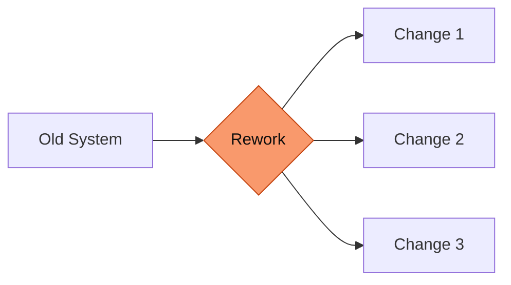

---
# Deck-wide configuration. See https://sli.dev/custom/#headmatter
theme: seriph
title: 'Project Title Goes Here: A Concise Subtitle'
titleTemplate: '%s — Cairo Motive'
info: |
  ## Project Presentation
  Architecture rework & new features overview.

  Built with [Slidev](https://sli.dev).
author: Cairo Motive
keywords: architecture,features,cairo-motive
# Apply unocss classes to the current slide
class: text-center
# https://sli.dev/features/drawing
drawings:
  persist: false
# slide transition: https://sli.dev/guide/animations#slide-transitions
transition: slide-left
# enable MDC Syntax: https://sli.dev/features/mdc
mdc: true
# Show line numbers in code blocks
lineNumbers: false
# Match the Zenith brand: dark (quantum-black) by default
colorSchema: dark
# Zenith uses a geometric grotesque (New Science); Space Grotesk is the closest
# freely-available analog. Headings forced to sans in style.css.
fonts:
  sans: Space Grotesk
  serif: Space Grotesk
  mono: Fira Code
# Aspect ratio of the slides
aspectRatio: 16/9
# Enable presenter mode notes
download: true
exportFilename: cairo-motive-deck
hideInToc: false
---

# Project Title Goes Here

A Concise, Descriptive Subtitle

<div class="pt-10 flex justify-center">
  
</div>

<div class="abs-bl m-6 text-sm opacity-70 text-left">
  <div>Supervised by Prof. Dr. Hazem Abbas &amp; Eng. Mahmoud Soliman</div>
  <div>Cairo Motive · {{ new Date().getFullYear() }}</div>
</div>

<!--
Presenter notes:
- Welcome the audience.
- State the project and what this talk covers: team, intro, architecture rework, new features.
- ~30 seconds.
-->

---
transition: fade-out
layout: default
---

# Outline

<Toc minDepth="1" maxDepth="1" columns="2" />

<!--
Roadmap of the talk. Point to the major sections and roughly how long each takes.
-->

---
layout: section
---

# 1. Team Members

The people behind the work

---
layout: default
---

# The Team

<div class="max-w-xl mx-auto mt-10">


| Name | ID |
|------|----|
| Farah Abdelrahman Kamalo| 2000901 |
| Khalid Ayman Alansary   | 2100259 |
| Maryam Yasser Mohammed | 2100730 |
| Mohamed Ashraf Mohamed  | 2100514 |
| Omar Abdelgaber Elsayed  | 2101048 |
| Salma Hamed Shaaban   | 2100636 |

</div>

<!--
Introduce the team briefly. Highlight who owns what so the audience knows
who to direct questions to.
-->

---
layout: section
---

# 2. Intro

What this project is, and why it matters

---
layout: default
---

# Introduction

<v-clicks>

- **What we built.** One sentence describing the product / system at a high level.
- **The problem.** What pain point or limitation drove this work?
- **Where we are.** Current status and what this presentation covers.

</v-clicks>

<div v-click class="mt-8 p-4 border-l-4 border-[#f9996c] bg-[#f9996c]/5 rounded">

> A short, memorable framing of the project the audience should carry through the talk.

</div>

<!--
Set context before diving into specifics. Keep it tight — the detail comes later.
-->

---
layout: section
---

# 3. Architecture Rework

What changed under the hood, and why

---
layout: default
---

# Architecture Rework — Overview

<v-clicks>

- **Why rework.** What was wrong / limiting about the old architecture?
- **Goals.** Performance, scalability, maintainability — the targets we set.
- **At a glance.** The three changes that follow.

</v-clicks>



<!--
Frame the rework as a whole before drilling into each piece.
-->

---
layout: default
---

# Architecture · 3.1 — First Change

<div class="grid grid-cols-5 gap-6">

<div class="col-span-3">

What this part of the rework addresses, explained at the right level of detail.

```text
Before:  describe the old approach
After:   describe the new approach
```

</div>

<div class="col-span-2">

<v-clicks>

**Impact**

- Benefit 1
- Benefit 2
- Trade-off / cost

</v-clicks>

</div>

</div>

<!--
Speaker notes for the first architectural change.
-->

---
layout: default
---

# Architecture · 3.2 — Second Change

<div class="grid grid-cols-5 gap-6">

<div class="col-span-3">

What this part of the rework addresses, explained at the right level of detail.

```text
Before:  describe the old approach
After:   describe the new approach
```

</div>

<div class="col-span-2">

<v-clicks>

**Impact**

- Benefit 1
- Benefit 2
- Trade-off / cost

</v-clicks>

</div>

</div>

<!--
Speaker notes for the second architectural change.
-->

---
layout: default
---

# Architecture · 3.3 — Third Change

<div class="grid grid-cols-5 gap-6">

<div class="col-span-3">

What this part of the rework addresses, explained at the right level of detail.

```text
Before:  describe the old approach
After:   describe the new approach
```

</div>

<div class="col-span-2">

<v-clicks>

**Impact**

- Benefit 1
- Benefit 2
- Trade-off / cost

</v-clicks>

</div>

</div>

<!--
Speaker notes for the third architectural change.
-->

---
layout: section
---

# 4. New Features

What we shipped, and what it unlocks

---
layout: default
---

# New Features — Overview

<v-clicks>

- **Feature 1** — one-line value proposition
- **Feature 2** — one-line value proposition
- **Feature 3** — one-line value proposition

</v-clicks>

<div v-click class="mt-8 text-sm opacity-70">
Built on the reworked architecture from §3 — each feature ties back to a change there.
</div>

<!--
Connect the features to the architecture rework: the rework is what made them possible.
-->

---
layout: two-cols
layoutClass: gap-8
---

# Feature · 4.1 — First Feature

<v-clicks>

**What it does**

- Capability 1
- Capability 2
- Capability 3

</v-clicks>

::right::

<div class="mt-14" />

<v-clicks>

**Why it matters**

- User-facing benefit
- Business / technical benefit
- Metric it moves

</v-clicks>

<!--
Demo hook: if there's a live demo for this feature, this is where to run it.
-->

---
layout: two-cols
layoutClass: gap-8
---

# Feature · 4.2 — Second Feature

<v-clicks>

**What it does**

- Capability 1
- Capability 2
- Capability 3

</v-clicks>

::right::

<div class="mt-14" />

<v-clicks>

**Why it matters**

- User-facing benefit
- Business / technical benefit
- Metric it moves

</v-clicks>

<!--
Demo hook for the second feature.
-->

---
layout: two-cols
layoutClass: gap-8
---

# Feature · 4.3 — Third Feature

<v-clicks>

**What it does**

- Capability 1
- Capability 2
- Capability 3

</v-clicks>

::right::

<div class="mt-14" />

<v-clicks>

**Why it matters**

- User-facing benefit
- Business / technical benefit
- Metric it moves

</v-clicks>

<!--
Demo hook for the third feature.
-->

---
layout: center
class: text-center
---

# Wrap-up

<div class="max-w-2xl mx-auto mt-6 text-left">

<v-clicks>

- **Team:** who built it
- **Intro:** what we set out to do
- **Architecture:** the rework and why it matters
- **Features:** what it unlocked

</v-clicks>

</div>

<!--
Land the plane. Recap the through-line: rework enabled the features.
-->

---
layout: center
class: text-center
---

# Thank You

Questions & Discussion

<div class="pt-8 opacity-70 text-sm">
  <div>Cairo Motive</div>
</div>

<!--
Pause. Take questions one at a time.
-->

---
layout: end
hideInToc: true
---
