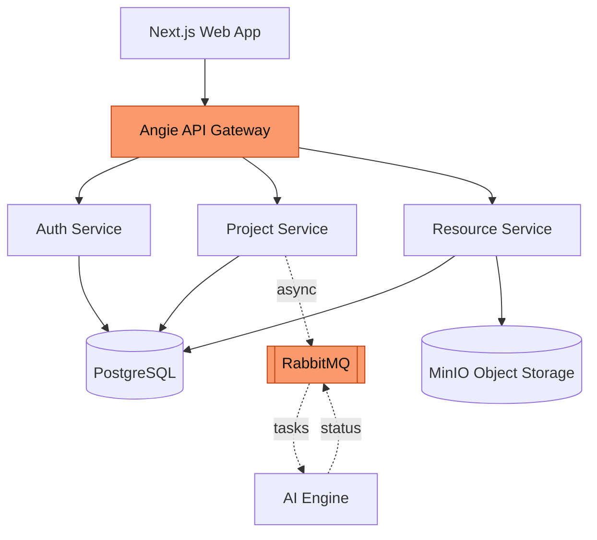

---
# Deck-wide configuration. See https://sli.dev/custom/#headmatter
theme: seriph
title: "AI Agents for the Automotive V-Cycle"
titleTemplate: "%s — CairoMotive"
info: |
  ## A Platform for AI-Assisted Software Engineering
  Orchestrating autonomous AI agents across the V-Cycle (SWE.1 / SWE.4 / SWE.6)
  with cybersecurity (TARA, SECO) and functional safety (HARA, FMEA, FTA) analysis.

  Built with [Slidev](https://sli.dev).
author: CairoMotive
keywords: v-cycle,aspice,iso26262,iso21434,ai-agents,cairo-motive
# Apply unocss classes to the current slide
class: text-center
# https://sli.dev/features/drawing
drawings:
  persist: false
# slide transition: https://sli.dev/guide/animations#slide-transitions
transition: slide-left
# enable MDC Syntax: https://sli.dev/features/mdc
mdc: true
# Show line numbers in code blocks
lineNumbers: false
# Match the product brand: dark (quantum-black) by default
colorSchema: dark
# The product uses a geometric grotesque (New Science); Space Grotesk is the closest
# freely-available analog. Headings forced to sans in style.css.
fonts:
  sans: Space Grotesk
  serif: Space Grotesk
  mono: Fira Code
# Aspect ratio of the slides
aspectRatio: 16/9
# Enable presenter mode notes
download: true
exportFilename: defense
hideInToc: false
---

# AI Agents for the Automotive V-Cycle

A Platform for AI-Assisted Software Engineering across the V-Cycle

<div class="pt-10 flex justify-center">
  
</div>

<div class="abs-bl m-6 text-sm opacity-70 text-left">
  <div>Supervised by Prof. Dr. Hazem Abbas &amp; Eng. Mahmoud Soliman</div>
  <div>CairoMotive · {{ new Date().getFullYear() }}</div>
</div>

<!--
Presenter notes:
- Welcome the audience.
- One line: the platform brings AI agents to the automotive V-Cycle, with flexible
  deployment — from managed cloud to fully self-hosted — so teams control where
  their code and requirements live.
- State what the talk covers: team, problem, architecture, the V-Cycle
  workspaces, safety & security, and results.
- ~30 seconds.
-->

---
transition: fade-out
layout: default
---

# Outline

<Toc minDepth="1" maxDepth="1" columns="2" />

<!--
Roadmap of the talk. Point to the major sections and roughly how long each takes.
-->

---
layout: section
---

# 1. Team

The people behind the work

---
layout: default
---

# The Team

<div class="max-w-xl mx-auto mt-10">

| Name                     | ID      |
| ------------------------ | ------- |
| Farah Abdelrahman Kamalo | 2000901 |
| Khalid Ayman Alansary    | 2100259 |
| Maryam Yasser Mohammed   | 2100730 |
| Mohamed Ashraf Mohamed   | 2100514 |
| Omar Abdelgaber Elsayed  | 2101048 |
| Salma Hamed Shaaban      | 2100636 |

</div>

<div class="mt-8 text-sm opacity-70 text-center">
Supervised by Prof. Dr. Hazem Abbas · in collaboration with CairoMotive
</div>

<!--
Introduce the team briefly. Mention the CairoMotive collaboration and the
supervising staff.
-->

---
layout: section
---

# 2. Introduction

What we built, and why it matters

---
layout: default
---

# The Context

<v-clicks>

- **The V-Cycle** is the dominant paradigm in automotive software, formalized by **ASPICE** — every development phase (SWE.1–3) has a matching verification phase (SWE.4–6).
- Standards like **ISO 26262** (functional safety) and **ISO 21434** (cybersecurity) mandate rigorous **traceability** between requirements, design, code, and tests.
- **LLM-based AI agents** can now plan, generate, and validate engineering artifacts — but most platforms are **rigid SaaS** with no control over deployment.

</v-clicks>

<div v-click class="mt-8 p-4 border-l-4 border-[#f9996c] bg-[#f9996c]/5 rounded">

> Organizations working with **proprietary code and confidential requirements** need **control over where artifacts and inference run** — and the option to keep them inside their own boundary.

</div>

<!--
Set the stage: V-Cycle + standards demand traceability; AI can help; but teams
need control over deployment and data governance. That flexibility is what the
platform provides.
-->

---
layout: default
---

# The Problem

<v-clicks>

- Generating test cases and requirements from documents is **high-effort** and must stay synchronized as requirements evolve.
- Manual work leads to **inconsistent interpretation**, **incomplete coverage**, and **brittle traceability** between a test and its originating requirement.
- Integrating AI into internal workflows raises **data-governance** concerns — teams need a say in **where** artifacts are stored and inference runs.

</v-clicks>

<div v-click class="mt-8 p-4 border-l-4 border-[#f9996c] bg-[#f9996c]/5 rounded">

> **The need:** a platform that integrates AI agents into the software lifecycle, maintains traceability, and can be deployed flexibly — from managed cloud services to fully self-hosted.

</div>

<!--
Three pain points. Land the framing: the value is rigor + automation + deployment
flexibility. Cloud services (e.g. LLM inference) are used by default, but every
component can be swapped for a self-hosted equivalent when policy demands it.
-->

---
layout: default
---

# Objectives & Scope

<div class="grid grid-cols-2 gap-8 mt-4">

<div>

**Objectives**

<v-clicks>

- A **self-hosted** platform that orchestrates AI agents for SE tasks
- A **service-based** architecture with a shared data layer for consistency
- **End-to-end type-safe** APIs (with language-agnostic OpenAPI)
- **Asynchronous** AI processing via a message broker
- **Containerized**, reproducible deployment + CI

</v-clicks>

</div>

<div>

**Scope — three V-Cycle stages**

<v-clicks>

- **SWE.1** — Software Requirements Analysis
- **SWE.4** — Software Unit Verification
- **SWE.6** — Software Qualification Testing

Plus security & safety workspaces:

- **TARA · SECO** — ISO 21434 cybersecurity
- **HARA · FMEA · FTA** — ISO 26262 functional safety

</v-clicks>

</div>

</div>

<!--
Objectives on the left, scope on the right. Stress that the AI engine itself is
an external service that consumes queued tasks — the platform orchestrates it.
-->

---
layout: section
---

# 3. System Architecture

How the platform is put together

---
layout: default
---

# Architecture — Service-Based

<div class="grid grid-cols-5 gap-6">

<div class="col-span-3">

A **service-based architecture**: independently deployable, coarse-grained domain services over a **single shared data layer**.



</div>

<div class="col-span-2">

<v-clicks>

**Why this style**

- Distributed, but far less complex/costly than full microservices
- Shared **PostgreSQL** ⇒ SQL joins, no data duplication
- Shared layer enables **end-to-end type safety**
- Gateway unifies entry; AI engine stays **external & async**

</v-clicks>

</div>

</div>

<!--
Pragmatic middle ground: separation of concerns at the service/API layer, but a
single shared data layer for consistency and type safety. The AI engine is
decoupled behind RabbitMQ.
-->

---
layout: default
---

# Core Components

<div class="max-w-3xl mx-auto mt-6">

| Component               | Responsibility                                       |
| ----------------------- | ---------------------------------------------------- |
| **Web App** (Next.js)   | User interface and client-side workflows             |
| **API Gateway** (Angie) | Unified entry point, JWT validation, rate limiting   |
| **Auth Service**        | Authentication, users, organizations, RBAC           |
| **Project Service**     | Projects, membership, AI request orchestration       |
| **Resource Service**    | File upload/download, storage abstraction            |
| **PostgreSQL**          | Shared relational database                           |
| **MinIO**               | Shared S3-compatible object storage                  |
| **RabbitMQ**            | Asynchronous AI task queue                           |

</div>

<!--
Walk the table top to bottom. The gateway does cross-cutting concerns so the
services stay focused. Resource service hides storage behind presigned URLs.
-->

---
layout: default
---

# Technology Stack

<div class="grid grid-cols-3 gap-6 mt-6">

<div v-click>

**Language & Runtime**

- TypeScript (full-stack)
- Bun runtime
- Shared code across FE/BE

</div>

<div v-click>

**API & Data**

- oRPC + OpenAPI contracts
- Drizzle ORM
- Zod schema validation
- Protocol Buffers (queue)

</div>

<div v-click>

**Frontend**

- Next.js (App Router)
- TanStack Query
- Tailwind CSS
- Component library

</div>

<div v-click>

**Auth & Gateway**

- JWT-based auth
- Angie gateway
- RBAC + multi-tenancy

</div>

<div v-click>

**Infra & DevOps**

- Docker Compose
- Dev Containers
- Turborepo monorepo
- GitHub Actions CI

</div>

<div v-click>

**Observability**

- Structured logging
- Centralized aggregation
- Langfuse AI tracing
- Health checks

</div>

</div>

<div v-click class="mt-6 text-sm opacity-70 text-center">
One type-safe contract from database → backend → frontend.
</div>

<!--
The through-line: a single TypeScript type system, enforced at every boundary by
oRPC, Drizzle, and Zod. Protocol Buffers carry the contract across the language
boundary to the AI engine.
-->

---
layout: default
---

# Asynchronous AI Processing

<div class="grid grid-cols-5 gap-6">

<div class="col-span-3">

AI generation is long-running, so the platform **decouples** it from the request/response cycle.

```text
1. User triggers generation (e.g. SWE.6 test specs)
2. Project service publishes a typed message → RabbitMQ
3. AI engine consumes the task, runs the agent
4. Status + results reported back; UI polls and updates live
```

</div>

<div class="col-span-2">

<v-clicks>

**Why it matters**

- **RabbitMQ** broker for reliable delivery
- **Protocol Buffers** enforce the message contract across languages
- Message type ⇒ explicit dispatch & request safety
- Enables **horizontal scaling** of AI workloads

</v-clicks>

</div>

</div>

<!--
This is what makes the platform responsive and scalable. The protobuf contract
gives type safety even across the TS ↔ AI-engine boundary. Real-time UI feedback
comes from per-SWE conditional polling.
-->

---
layout: section
---

# 4. The V-Cycle Workspaces

SWE.1 · SWE.4 · SWE.6

---
layout: two-cols
layoutClass: gap-8
---

# SWE.1 — Requirements Analysis

<v-clicks>

**What it does**

- Upload **system requirements** documents
- AI generates **software requirements** for each
- Status workflow: Draft → In Review → Accepted / Rejected
- Configurable attributes (ASIL, verification method, status)

</v-clicks>

::right::

<div class="mt-14" />

<v-clicks>

**Traceability**

- Each software req shows a **"refines"** link to its system req
- Click an ID to navigate the trace chain, then return
- Coverage analysis flags system reqs with **no** software reqs

</v-clicks>

<!--
Demo hook: show the collapsed system-req list, expand to reveal generated
software reqs, then click a refines link to walk the traceability chain.
-->

---
layout: two-cols
layoutClass: gap-8
---

# SWE.4 — Unit Verification

<v-clicks>

**What it does**

- Upload C/C++ code via **zip** or **GitHub import**
- Browse code in a **file tree** with inline viewing
- Trigger **unit test generation**
- Generated tests appear alongside source files

</v-clicks>

::right::

<div class="mt-14" />

<v-clicks>

**Coverage reporting**

- Line, branch, and function **coverage %**
- Real-time generation status at the top of the page
- Tests organized in the tree next to the code they verify

</v-clicks>

<!--
Demo hook: import a small C project, generate tests, then open the coverage
report tab.
-->

---
layout: two-cols
layoutClass: gap-8
---

# SWE.6 — Qualification Testing

<v-clicks>

**What it does**

- Upload requirement documents
- AI generates **test specifications**
- Specs organized **under their software requirements**
- Specs appear **incrementally** as they generate

</v-clicks>

::right::

<div class="mt-14" />

<v-clicks>

**Detail & traceability**

- Card summary → click for **full spec modal**
- Traceability matrix maps **test specs → software reqs**
- **Communication matrix** (FIBEX) validation & chunk mapping

</v-clicks>

<!--
Demo hook: upload reqs, watch specs stream in live, open a spec modal, then show
the traceability matrix tab.
-->

---
layout: default
---

# Traceability & Validation

<div class="grid grid-cols-2 gap-8 mt-4">

<div>

<v-clicks>

**Traceability Matrix**

- SWE.1: software reqs → system reqs
- SWE.6: test specs → software reqs
- End-to-end visibility, requirements → verification
- Automatic coverage gap detection

</v-clicks>

</div>

<div>

<v-clicks>

**AI Validation**

- Checks clarity, atomicity, consistency
- Flags redundancies, conflicts, ambiguities
- Suggests edits and refinements
- FIBEX communication-matrix quality report

</v-clicks>

</div>

</div>

<div v-click class="mt-8 p-4 border-l-4 border-[#f9996c] bg-[#f9996c]/5 rounded">

> Traceability is maintained **automatically** as artifacts are generated — the core compliance pain point of the V-Cycle.

</div>

<!--
Tie back to the intro: this is the manual, error-prone work that the standards
demand and that the platform automates.
-->

---
layout: section
---

# 5. Safety & Security

Beyond the V-Cycle

---
layout: default
---

# Cybersecurity & Functional Safety

<div class="grid grid-cols-2 gap-8 mt-4">

<div>

<v-clicks>

**ISO 21434 — Cybersecurity**

- **TARA** — Threat Analysis & Risk Assessment
- **SECO** — Security Concepts report generation

</v-clicks>

</div>

<div>

<v-clicks>

**ISO 26262 — Functional Safety**

- **HARA** — Hazard Analysis & Risk Assessment
- **FMEA** — Failure Mode & Effects Analysis (AIAG/VDA)
- **FTA** — Fault Tree Analysis with cut-set identification

</v-clicks>

</div>

</div>

<div v-click class="mt-8 text-sm opacity-80">

Each workspace provides **AI-assisted report generation**, structured data management, and professional **Excel export** with domain-specific formatting.

</div>

<!--
These extend the platform beyond pure V-Cycle development into the
safety/security analysis that automotive programs require alongside it.
-->

---
layout: section
---

# 6. Engineering & Operations

Type safety, deployment, observability

---
layout: default
---

# DevOps & Developer Experience

<div class="grid grid-cols-2 gap-8 mt-4">

<div>

<v-clicks>

**Deployment**

- Fully containerized via **Docker Compose**
- Automated init, **health checks**, startup orchestration
- Secrets via Compose secrets + OpenBao/Varlock
- Cloud components swappable for self-hosted equivalents

</v-clicks>

</div>

<div>

<v-clicks>

**Developer Experience**

- **Turborepo** monorepo with caching
- **Dev Containers** for reproducible environments
- CI checks + container publishing pipelines
- Mocked AI engine for local development

</v-clicks>

</div>

</div>

<div v-click class="mt-6 text-sm opacity-70">

Observability: structured logging, centralized aggregation, **Langfuse** AI-workflow tracing, and health endpoints.

</div>

<!--
Self-hosting and reproducibility are the operational backbone. Dev Containers +
mocked AI engine let the team develop without the real engine running.
-->

---
layout: section
---

# 7. Results

What we delivered

---
layout: default
---

# Summary of Achievements

<v-clicks>

- **Unified architecture** — service-based, clear separation of concerns over a shared PostgreSQL + MinIO data layer.
- **End-to-end type safety** — TypeScript with oRPC contracts, Drizzle schemas, and Zod validation across the whole stack.
- **Flexible deployment** — fully containerized and reproducible; runs on managed cloud services or fully self-hosted by swapping in self-hosted components.
- **Three V-Cycle stages** — SWE.1, SWE.4, SWE.6 with live status, MinIO file management, and async RabbitMQ processing.
- **Safety & security workspaces** — TARA, SECO, HARA, FMEA, FTA with AI-assisted generation and Excel export.
- **Scalability foundation** — async message queuing enabling horizontal scaling of AI workloads.

</v-clicks>

<!--
This recaps the conclusion's "Summary of Achievements." Each bullet maps to a
section the audience just saw.
-->

---
layout: center
class: text-center
---

# Conclusion & Future Work

<div class="max-w-2xl mx-auto mt-6 text-left">

<v-clicks>

- **Delivered:** a platform bringing AI agents to the automotive V-Cycle, deployable from managed cloud to fully self-hosted for control over data and inference.
- **Next:** expand testing infrastructure and CI/CD maturity.
- **Next:** continuous deployment & release management.
- **Next:** security & supply-chain hardening.
- **Next:** further V-Cycle expansion (SWE.2, SWE.3, SWE.5) and deeper safety/security analysis.

</v-clicks>

</div>

<!--
Land the plane: rigor + automation + confidentiality, with a clear path to
covering the rest of the V.
-->

---
layout: center
class: text-center
---

# Thank You

Questions & Discussion

<div class="pt-8 opacity-70 text-sm">
  <div>CairoMotive</div>
  <div>Supervised by Prof. Dr. Hazem Abbas &amp; Eng. Mahmoud Soliman</div>
</div>

<!--
Pause. Take questions one at a time.
-->

---
layout: end
hideInToc: true
---
